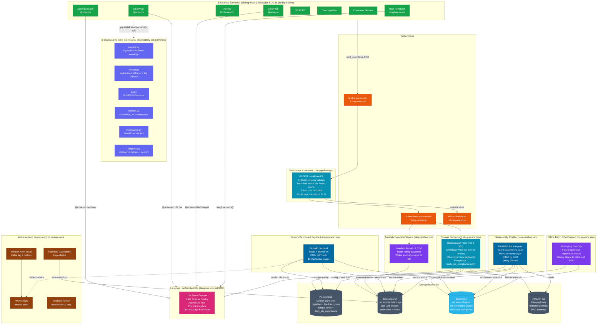

# AI Services Platform — Full Observability Architecture Diagram

> **How to render:**
> 1. Go to [mermaid.live](https://mermaid.live)
> 2. Delete everything in the editor
> 3. Copy **only** the lines between the triple-backtick fences below (start from `flowchart TD`, do NOT include the word `mermaid`)
> 4. Paste into the editor

---



---

## Colour Legend

| Colour | Layer |
|---|---|
| Indigo | `ai-observability-sdk` — shared pip package |
| Green | 8 Business Services — existing repos, add SDK as dependency |
| Orange | Kafka Topics — raw / processed / dead-letter |
| Cyan | Kafka Consumers — Enrichment + Storage (obs-pipeline) |
| Violet | Analytics Services — Anomaly Detection + RCA Engine (obs-pipeline) |
| Blue | Presentation Services — Custom Dashboard + Chatbot (obs-pipeline) |
| Slate | Storage Backends — PostgreSQL (control plane) + Elasticsearch (hot events) + S3 (payloads) |
| Blue | Snowflake — all events forever, on-demand analytics, BI |
| Pink | Langfuse — self-hosted LLM/RAG/Agent trace UI |
| Brown | Infrastructure — Fluent Bit, kminion, Prometheus, Tempo (deploy only) |

---

## Data Flow Summary (plain text)

```
8 Business Services  (add SDK as pip dependency)
   |
   |-- emit_event() via SDK ---------> ai-obs-events-raw  (Kafka)
   |                                          |
   |                               Enrichment Consumer
   |                               validate + enrich + cost
   |                                  |            |
   |                               invalid      enriched
   |                                  |            |
   |                           dead-letter    ai-obs-events-processed  (Kafka)
   |                                                |
   |                                    +-----------+-----------+
   |                                    |                       |
   |                            Storage Consumer       Anomaly Detection
   |                            ES + Snowflake         Isolation Forest
   |                            + S3 + PG(slo only)
   |                                                           |
   |                                                   ES anomalies index
   |
   |-- @observe  (Agent Executor, GSSP GS, GSSP QS) --> Langfuse
   |-- langfuse.score()  (User Feedback)             --> Langfuse


Presentation reads from storage:
   Custom Dashboard --> PostgreSQL + Elasticsearch + Prometheus (Kafka metrics)
   Chatbot          --> PostgreSQL + Elasticsearch + S3 + Langfuse
   RCA Engine       --> PostgreSQL + Elasticsearch  (nightly, digest to Slack/SES)

Infrastructure (deploy only - no custom code):
   Fluent Bit DaemonSet --> Elasticsearch  (container logs)
   kminion              --> Prometheus     (Kafka metrics)
   Grafana Tempo                           (trace backend, receives OTel traces)
```

---

## Repository Map

| Repo | Type | Contents |
|---|---|---|
| `ai-observability-sdk` | New — pip package | models, emitter, pii, context, middleware, langfuse helpers |
| `obs-pipeline` | New — services | enrichment-consumer, storage-consumer, custom-dashboard, anomaly-detection, rca-engine, obs-chatbot |
| `observability-iac` | New — infra | Kafka topic scripts, PostgreSQL DDL migrations, ES index templates, CI deploy pipeline |
| `agentic-orchestration` | Existing | Add SDK + ObsMiddleware + emit_event() calls |
| `agent-executor` | Existing | Add SDK + @observe on step execution loop |
| `gssp-gs` | Existing | Add SDK + @observe on LLM generator functions |
| `gssp-qs` | Existing | Add SDK + @observe on all 5 RAG pipeline stages |
| `gssp-rs` | Existing | Add SDK + emit_event() on retrieve and embed |
| `data-ingestion` | Existing | Add SDK + emit_event() calls |
| `consumer-service` | Existing | Add SDK + emit_event() calls |
| `user-feedback` | Existing | Add SDK + ObsMiddleware + langfuse.score() |
