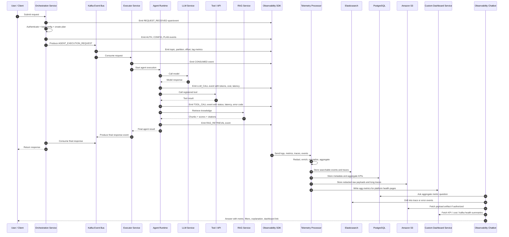
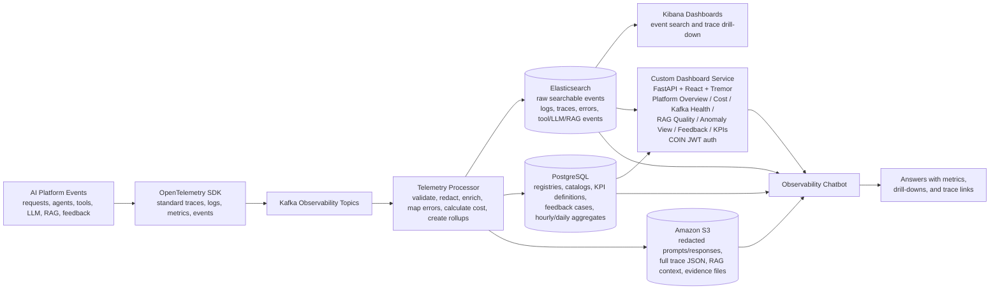
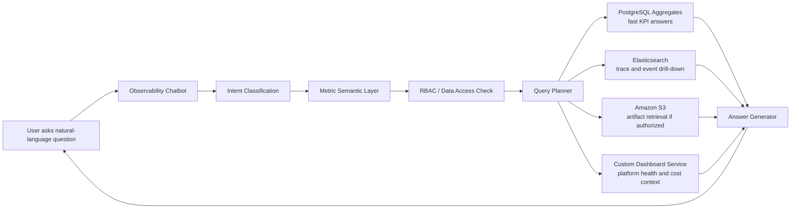

# AI Services Platform — Observability Plane Architecture

## 0. Context and Objective

The current AI Services Platform supports multiple AI execution styles, including:

- Normal prompt-based LLM requests
- RAG / knowledge retrieval flows
- Single-agent flows
- Multi-agent flows
- Loop-agent flows
- Tool-augmented agent workflows
- Guardrail-controlled execution
- Memory-enabled execution
- Async execution through Kafka

The goal is to build a complete **Observability Plane** that gives platform, application, and business teams visibility into:

- User requests
- Agent executions
- Agent steps
- LLM calls
- Token usage
- Cost
- RAG retrieval quality
- Tool calls
- Tool failures
- Guardrail decisions
- Memory usage
- User feedback
- Positive / negative sentiment
- Errors and root causes
- Business KPIs
- SLA / SLO health
- Natural-language Q&A through an Observability Chatbot

This document is an enhanced architecture and implementation plan based on the current platform design and dashboard requirements.

---

## 1. Updated Target Architecture

The updated architecture assumes:

- **Elasticsearch / Kibana** will continue to be used for logs, event search, trace search, and operational dashboards.
- **PostgreSQL** will be used for metadata, registry, KPI definitions, aggregate metric tables, and chatbot-ready summary data.
- **Amazon S3** will be used as the object store for redacted prompts, responses, traces, RAG contexts, audit files, and long payloads.
- **Custom Dashboard Service** (FastAPI + React + Tremor) will be used for infrastructure/platform monitoring and service health dashboards — COIN JWT auth, no external tools required.
- **Apache Kafka** will continue to support async agent execution and observability event streaming.
- **OpenTelemetry / Observability SDK** will standardize trace, metric, log, and event capture across the platform.

> Note: The Custom Dashboard Service is the platform's own visualization layer (FastAPI backend + React + Tremor UI). It connects to PostgreSQL aggregate tables, Elasticsearch, and Langfuse API. No Grafana dependency.

---

## 2. Enhanced Architecture Diagram

```mermaid
flowchart LR

    subgraph SRC["1. Observability Data Sources"]
        UI["UI / Chat / Web App"]
        API["API Requests"]
        AGREG["Agent Registration"]
        TOOLREG["Tool Registration"]
        PROMPT["Prompt / RAG Requests"]
        FEEDBACK["User Feedback"]
        INFRA["System & Infra Signals"]
        EXT["External Integrations"]
    end

    subgraph PLATFORM["2. AI Services Platform"]
        CLIENT["Client / Application"]

        subgraph ORCH["Orchestration Service"]
            PLANNER["Planner"]
            RESP["Response Processor"]
            CONFIG["Config Loader"]
            AUTH["Auth / Access Check"]
        end

        KAFKA["Kafka Event Bus"]

        subgraph EXEC["Executor Service"]
            CONSUMER["Message Consumer"]
            AGENTORCH["Agent Orchestrator"]
            RUNTIME["Agent Execution Runtime"]
        end

        LLM["LLM / Model Services"]
        RAG["RAG / Knowledge Retrieval"]
        TOOLS["Tools / External APIs"]
        MEMORY["Memory Module"]
        GUARD["Guardrails / Policy Engine"]

        EVIDENCE["Evidence Store"]
        CASESTATE["Case State"]
        AUDIT["Audit Logs"]
    end

    subgraph COLLECT["3. Observability Collection"]
        SDK["OpenTelemetry SDK / Platform Instrumentation"]
        TRACES["Traces / Spans / Correlation IDs"]
        LOGS["Structured Logs"]
        METRICS["Metrics / Counters / Histograms"]
        EVENTS["Domain Events"]
        CUSTOM["Custom Signals: Tokens, Cost, Quality, Feedback"]
    end

    subgraph PIPE["4. Ingestion & Processing Pipeline"]
        OBSKAFKA["Kafka Observability Topics<br/>traces | logs | metrics | events | audit"]
        PROCESSOR["Telemetry Processor / Enrichment Layer<br/><br/>- Schema validation<br/>- PII redaction<br/>- Metadata enrichment<br/>- Error mapping<br/>- Token & cost calculation<br/>- Trace relationship building<br/>- Aggregation & rollup generation<br/>- SLA/SLO evaluation"]
    end

    subgraph STORE["5. Data & Storage Layer"]
        ES["Elasticsearch<br/><br/>Operational event store<br/>Logs, errors, traces, LLM/tool/RAG events, feedback search"]
        PG["PostgreSQL<br/><br/>Metadata + aggregates<br/>Registries, KPI definitions, error catalog, feedback cases, rollups"]
        S3["Amazon S3<br/><br/>Object store<br/>Redacted prompts, responses, full trace payloads, RAG contexts, uploaded docs, audit evidence"]
        CUSTOMDASH["Custom Dashboard Service<br/><br/>FastAPI + React + Tremor<br/>Platform Overview, Cost, KPIs,<br/>Kafka Health, RAG Quality,<br/>Anomaly View, Feedback Trends<br/>COIN JWT auth"]
    end

    subgraph PRESENT["6. Observability Presentation"]
        KIBANA["Kibana Dashboards<br/>Operational search and event analytics"]
        GFDASH["Custom Dashboard Pages<br/>Platform health, Cost Governance, KPIs"]
        APPDASH["Application Overview<br/>Usage, errors, latency"]
        AGENTDASH["Agent Observability<br/>success rate, steps, tool usage, cost"]
        RAGDASH["RAG Observability<br/>hit rate, no-result rate, relevance, citations"]
        TOOLDASH["Tool Health<br/>failures, retries, timeout, dependency health"]
        LLMVIEW["LLM Observability<br/>tokens, cost, latency, model errors"]
        FEEDVIEW["Feedback Analytics<br/>positive/negative, categories, trends"]
        TRACEVIEW["Trace Explorer<br/>end-to-end request drill-down"]
    end

    subgraph CHAT["7. Observability Chatbot"]
        BOT["Observability Chatbot"]
        INTENT["Intent Classification"]
        SEM["Metric Semantic Layer"]
        RBAC["RBAC / Access Control"]
        QP["Query Planner"]
        ANSWER["Answer Generator<br/>metric + filters + explanation + dashboard link"]
    end

    SRC --> CLIENT
    CLIENT --> AUTH
    AUTH --> CONFIG
    CONFIG --> PLANNER
    PLANNER --> KAFKA
    KAFKA --> CONSUMER
    CONSUMER --> AGENTORCH
    AGENTORCH --> RUNTIME
    RUNTIME --> LLM
    RUNTIME --> RAG
    RUNTIME --> TOOLS
    RUNTIME --> MEMORY
    RUNTIME --> GUARD
    RUNTIME --> CASESTATE
    RUNTIME --> EVIDENCE
    RUNTIME --> AUDIT
    RESP --> CLIENT

    CLIENT -. telemetry .-> SDK
    AUTH -. spans .-> SDK
    CONFIG -. config events .-> SDK
    PLANNER -. planner events .-> SDK
    KAFKA -. lag / offsets .-> SDK
    EXEC -. execution events .-> SDK
    LLM -. token / model metrics .-> SDK
    RAG -. retrieval quality .-> SDK
    TOOLS -. tool-call events .-> SDK
    MEMORY -. memory events .-> SDK
    GUARD -. policy events .-> SDK
    FEEDBACK -. feedback events .-> SDK

    SDK --> TRACES
    SDK --> LOGS
    SDK --> METRICS
    SDK --> EVENTS
    SDK --> CUSTOM

    TRACES --> OBSKAFKA
    LOGS --> OBSKAFKA
    METRICS --> OBSKAFKA
    EVENTS --> OBSKAFKA
    CUSTOM --> OBSKAFKA
    OBSKAFKA --> PROCESSOR

    PROCESSOR --> ES
    PROCESSOR --> PG
    PROCESSOR --> S3
    PROCESSOR --> CUSTOMDASH

    ES --> KIBANA
    ES --> APPDASH
    ES --> AGENTDASH
    ES --> RAGDASH
    ES --> TOOLDASH
    ES --> LLMVIEW
    ES --> FEEDVIEW
    ES --> TRACEVIEW

    PG --> APPDASH
    PG --> AGENTDASH
    PG --> RAGDASH
    PG --> TOOLDASH
    PG --> LLMVIEW
    PG --> FEEDVIEW

    CUSTOMDASH --> GFDASH
    CUSTOMDASH --> APPDASH

    S3 --> TRACEVIEW

    BOT --> INTENT
    INTENT --> SEM
    SEM --> RBAC
    RBAC --> QP
    QP --> PG
    QP --> ES
    QP --> S3
    QP --> CUSTOMDASH
    PG --> ANSWER
    ES --> ANSWER
    S3 --> ANSWER
    CUSTOMDASH --> ANSWER
    ANSWER --> BOT
```



---

## 3. End-to-End Event Flow



---

## 4. Storage Architecture Without ClickHouse

Since ClickHouse is not available, the recommended architecture is:

| Layer | Technology | Purpose |
|---|---|---|
| Operational event store | **Elasticsearch** | Logs, traces, error search, recent analytics, Kibana dashboards |
| Metadata and aggregate store | **PostgreSQL** | Registries, KPI definitions, feedback cases, aggregate metrics, chatbot summary layer |
| Object store | **Amazon S3** | Redacted prompts, responses, long traces, RAG contexts, uploaded documents, audit evidence |
| Platform dashboard | **Custom Dashboard Service** | FastAPI + React + Tremor; Platform Overview, Cost Governance, Kafka Health, RAG Quality, Anomaly View, Feedback Trends — COIN JWT auth |
| Operational dashboard layer | **Kibana** | Event/log analytics, trace drill-down, error exploration |
| Chatbot data layer | **PostgreSQL + Elasticsearch + Amazon S3** | Aggregate answers, drill-down search, secure artifact retrieval |

### Recommended Data Flow

```text
AI Platform Components
    ↓
OpenTelemetry SDK / Observability Middleware
    ↓
Kafka Observability Topics
    ↓
Telemetry Processor / Enrichment Layer
    ↓
Elasticsearch + PostgreSQL + Amazon S3 + Custom Dashboard Service
    ↓
Kibana Dashboards + Custom Dashboard Service + Observability Chatbot
```

---

## 5. Role of Each Storage Component

### 5.1 Elasticsearch

Use Elasticsearch for high-cardinality, searchable operational telemetry.

Store:

- Request events
- Response events
- Error events
- Agent step events
- LLM call events
- Tool call events
- RAG retrieval events
- Guardrail events
- Feedback events
- Trace spans
- Stack traces
- Exception logs

Suggested Elasticsearch indices:

```text
ai-observability-requests-*
ai-observability-agent-steps-*
ai-observability-llm-calls-*
ai-observability-tool-calls-*
ai-observability-rag-events-*
ai-observability-guardrail-events-*
ai-observability-feedback-*
ai-observability-errors-*
ai-observability-traces-*
```

Use Elasticsearch for questions such as:

- Show all failed traces for application `179524`.
- What errors occurred in the last 15 days?
- Which requests failed with `GR003`?
- Which tool calls timed out today?
- Show the full trace for this request.

---

### 5.2 PostgreSQL

Use PostgreSQL for structured metadata, governance, registries, and aggregated metrics.

Store:

- Application registry
- Agent registry
- Tool registry
- Prompt template registry
- RAG registry
- Error code catalog
- KPI definitions
- Feedback cases
- Dashboard configurations
- Alert thresholds
- Hourly aggregate metrics
- Daily aggregate metrics
- Chatbot semantic metric catalog

Core tables:

```text
application_registry
agent_registry
tool_registry
prompt_template_registry
rag_registry
kpi_definition
error_code_catalog
feedback_case
metric_catalog
dashboard_config
alert_threshold
agg_hourly_application_metrics
agg_hourly_agent_metrics
agg_hourly_tool_metrics
agg_hourly_llm_metrics
agg_hourly_rag_metrics
agg_daily_feedback_metrics
agg_daily_kpi_metrics
```

Use PostgreSQL for questions such as:

- How many requests did an application process yesterday?
- What was the daily success rate?
- Which agent has the highest failure rate this week?
- What is the token cost by application this month?
- What is the negative feedback trend for an agent?

---

### 5.3 Amazon S3

Amazon S3 is the object store for large, semi-structured, or sensitive artifacts that should not live directly in Elasticsearch or PostgreSQL.

Store:

- Redacted prompts
- Redacted model responses
- Full trace JSON payloads
- RAG retrieved contexts
- Uploaded documents
- Audit evidence files
- Long request/response payloads
- Debug bundles
- Offline RCA artifacts

Example S3 layout:

```text
s3://ai-observability-prod/
  raw/
    year=2026/month=05/day=13/application_id=179524/correlation_id=abc123.json
  redacted-prompts/
    year=2026/month=05/day=13/application_id=179524/correlation_id=abc123.json
  rag-contexts/
    year=2026/month=05/day=13/application_id=179524/correlation_id=abc123.json
  audit-evidence/
    year=2026/month=05/day=13/application_id=179524/evidence_id=ev123.json
  debug-bundles/
    year=2026/month=05/day=13/application_id=179524/correlation_id=abc123.zip
```

Store only references in Elasticsearch/PostgreSQL:

```json
{
  "correlation_id": "trace_abc123",
  "application_id": "179524",
  "raw_payload_s3_uri": "s3://ai-observability-prod/redacted-prompts/year=2026/month=05/day=13/application_id=179524/correlation_id=abc123.json",
  "rag_context_s3_uri": "s3://ai-observability-prod/rag-contexts/year=2026/month=05/day=13/application_id=179524/correlation_id=abc123.json"
}
```

Recommended S3 controls:

- Server-side encryption with KMS
- Bucket policies by environment
- Application-level folder partitioning
- Retention lifecycle policies
- Restricted access to raw payloads
- Redaction before write
- Audit logging for reads
- Object versioning for audit evidence if required

---

### 5.4 Custom Dashboard Service

Use the Custom Dashboard Service (FastAPI + React + Tremor) for platform health and visualization. This is the platform's own internal dashboard — COIN JWT auth, no external visualization tool required.

The Custom Dashboard Service covers:

- Service availability (Platform Overview page)
- API latency — p95 per service (Platform Overview page)
- Kafka consumer lag by topic (Kafka Health page)
- Kafka throughput and DLQ counts (Kafka Health page)
- LLM cost by application and model (Cost Governance page)
- Budget utilisation vs. cap (Cost Governance page)
- RAG quality metrics — no-result rate, faithfulness, citation coverage (RAG Quality page)
- Vector index freshness (RAG Quality page)
- Business KPIs — zero-touch rate, resolution time, SLA adherence (Business KPI page)
- Anomaly detection results (Anomaly View page)
- Feedback sentiment trends (Feedback Trends page)

Data sources for the Custom Dashboard Service:

- **PostgreSQL** `agg_*` tables — pre-computed hourly/daily rollups
- **Elasticsearch** `ai-obs-anomalies-*` — anomaly detection results
- **Langfuse API** — LLM quality scores, faithfulness, RAG evals
- **Prometheus** — infrastructure metrics proxied through FastAPI endpoints

**Architecture:**

```
PostgreSQL agg_* tables ──┐
Elasticsearch anomalies ──┤──► FastAPI /api/v1/* ──► React + Tremor UI
Langfuse SDK              ──┤                         COIN JWT auth
Prometheus metrics        ──┘
```


---

### 5.5 End-to-End Storage Component Mapping

This table maps every major observability data category to the correct storage component. The intent is to keep each storage layer focused: **Elasticsearch for searchable operational events**, **PostgreSQL for governed metadata and aggregates**, **Amazon S3 for large payloads/artifacts**, and the **Custom Dashboard Service for platform health visualization**.

| Storage Component | Data / Information Stored | Physical Object | Grain / Level | Purpose | Typical Consumers |
|---|---|---|---|---|---|
| **Elasticsearch** | Request, response, and error events | `ai-observability-requests-*`, `ai-observability-errors-*` | One document per event | Searchable operational telemetry and troubleshooting | Kibana dashboards, trace explorer, chatbot drill-down |
| **Elasticsearch** | Agent step events | `ai-observability-agent-steps-*` | One document per agent step/span | Agent execution visibility, step-level failures, loop analysis | Agent dashboard, RCA workflow, chatbot |
| **Elasticsearch** | LLM call events | `ai-observability-llm-calls-*` | One document per model call | Model latency, model errors, token traces, prompt-template failures | LLM dashboard, token/cost analysis, chatbot |
| **Elasticsearch** | Tool call events | `ai-observability-tool-calls-*` | One document per tool/API call | Tool success/failure analysis, timeouts, retries, dependency health | Tool dashboard, incident analysis, chatbot |
| **Elasticsearch** | RAG retrieval events | `ai-observability-rag-events-*` | One document per retrieval/generation event | Retrieval quality, no-result rate, citation coverage, vector/search errors | RAG dashboard, knowledge-base owners, chatbot |
| **Elasticsearch** | Guardrail and policy events | `ai-observability-guardrail-events-*` | One document per guardrail decision | Safety, policy, PII redaction, blocked-stage analysis | Guardrail dashboard, compliance review, chatbot |
| **Elasticsearch** | Feedback search events | `ai-observability-feedback-*` | One document per feedback event | Fast search of feedback linked to traces and responses | Feedback dashboard, quality review, chatbot |
| **Elasticsearch** | Full trace/searchable spans metadata | `ai-observability-traces-*` | One document per span or trace summary | End-to-end trace drill-down by `correlation_id` / `span_id` | Trace explorer, RCA, chatbot |
| **PostgreSQL** | Application registry | `application_registry` | One row per application | Application ownership, filtering, access control, SOE/LOB mapping | Dashboards, chatbot, alert routing |
| **PostgreSQL** | Agent registry | `agent_registry` | One row per agent/version | Agent ownership, version tracking, type classification | Agent dashboard, chatbot, governance |
| **PostgreSQL** | Tool registry | `tool_registry` | One row per tool/version | Tool metadata, SLA, endpoint, owner mapping | Tool dashboard, RCA, chatbot |
| **PostgreSQL** | Prompt template registry | `prompt_template_registry` | One row per template/version | Prompt governance, version control, model mapping | LLM dashboard, prompt analysis, chatbot |
| **PostgreSQL** | RAG registry | `rag_registry` | One row per knowledge base/index | Knowledge-base ownership, vector index, embedding model mapping | RAG dashboard, chatbot, governance |
| **PostgreSQL** | Error code catalog | `error_code_catalog` | One row per error code | Standardized error definitions, severity, category, runbook | Error dashboard, alerting, RCA chatbot |
| **PostgreSQL** | KPI definitions | `kpi_definition` | One row per KPI | Business KPI formulas, thresholds, ownership, reportability | KPI dashboard, business reporting, chatbot |
| **PostgreSQL** | Feedback cases | `feedback_case` | One row per user/SME feedback item | Feedback workflow, sentiment, category, resolution status | Feedback dashboard, quality improvement, chatbot |
| **PostgreSQL** | Dashboard configurations | `dashboard_config` | One row per dashboard/widget configuration | Dashboard metadata, filters, ownership, visibility | Dashboard service, admin UI |
| **PostgreSQL** | Alert thresholds | `alert_threshold` | One row per alert rule/threshold | Threshold conditions surfaced as KPI card colours in Custom Dashboard Service | Custom Dashboard Service KPI cards, incident routing |
| **PostgreSQL** | Chatbot semantic metric catalog | `metric_catalog` | One row per governed metric | Metric names, aliases, formulas, dimensions, approved sources | Observability chatbot, dashboard consistency |
| **PostgreSQL** | Hourly application metrics | `agg_hourly_application_metrics` | One row per application per hour | Fast application-level rollups | Executive dashboard, chatbot, SLA reporting |
| **PostgreSQL** | Hourly agent metrics | `agg_hourly_agent_metrics` | One row per agent per hour | Fast agent-level rollups | Agent dashboard, chatbot |
| **PostgreSQL** | Hourly tool metrics | `agg_hourly_tool_metrics` | One row per tool per hour | Fast tool health and dependency rollups | Tool dashboard, chatbot, alerting |
| **PostgreSQL** | Hourly LLM metrics | `agg_hourly_llm_metrics` | One row per model / prompt / agent per hour | Token, cost, latency, and model reliability rollups | LLM dashboard, cost dashboard, chatbot |
| **PostgreSQL** | Hourly RAG metrics | `agg_hourly_rag_metrics` | One row per RAG source per hour | Retrieval quality and no-result rollups | RAG dashboard, chatbot |
| **PostgreSQL** | Daily feedback metrics | `agg_daily_feedback_metrics` | One row per app/agent/day | Feedback sentiment and quality trend rollups | Feedback dashboard, leadership reporting |
| **PostgreSQL** | Daily KPI metrics | `agg_daily_kpi_metrics` | One row per KPI/app/agent/day | Business KPI values, trends, threshold status | KPI dashboard, business stakeholders, chatbot |
| **Amazon S3** | Redacted prompts and responses | `s3://ai-observability-*/redacted-prompts/`, `s3://ai-observability-*/redacted-responses/` | One object per trace/request | Secure archive of large or sensitive model payloads | Trace drill-down, audit, controlled chatbot retrieval |
| **Amazon S3** | Full trace JSON payloads | `s3://ai-observability-*/raw-traces/` | One object per trace | Complete end-to-end trace archive beyond searchable metadata | RCA, audit, offline analysis |
| **Amazon S3** | RAG contexts and retrieved chunks | `s3://ai-observability-*/rag-contexts/` | One object per RAG request/trace | Store retrieved context without bloating Elasticsearch/PostgreSQL | RAG quality review, audit, chatbot with access checks |
| **Amazon S3** | Uploaded documents and evidence artifacts | `s3://ai-observability-*/uploaded-documents/`, `s3://ai-observability-*/audit-evidence/` | One object per file/artifact | Long-term artifact storage with retention controls | Audit review, compliance, RCA |
| **Amazon S3** | Debug bundles and offline RCA exports | `s3://ai-observability-*/debug-bundles/` | One object per incident/trace bundle | Exportable investigation package | Support teams, incident review |
| **Custom Dashboard Service** | Platform health pages — Overview, Cost Governance, Kafka Health, RAG Quality, Anomaly View, Feedback Trends, Business KPIs | FastAPI backend reading PostgreSQL `agg_*` tables, Elasticsearch anomalies, Langfuse, and Prometheus | Aggregate / dashboard page | Pre-computed rollups pulled on demand via REST; COIN JWT auth | Long-lived config | SRE, platform operations, leadership, app owners |
| **Kibana** | Operational dashboards over Elasticsearch | Kibana data views and dashboards | Event/log analytics view | Event search, error analysis, trace drill-down | App teams, support teams, platform team |

### 5.6 Detailed Data Store Responsibility Map

The following map expands the storage responsibility model across **all data stores**, not only PostgreSQL. It defines which store owns which data object, the object/index/table/bucket path to create, the expected grain, retention posture, update mechanism, and primary consumers.

#### 5.6.1 Master Storage Responsibility Matrix

| Data Store | Storage Object / Table / Index / Bucket Path | Responsibility | Data Grain | Write Pattern | Typical Retention | Primary Consumers |
|---|---|---|---|---|---|---|
| **Elasticsearch** | `ai-observability-requests-*` | Raw searchable platform request and response events | One document per request lifecycle event | Near real-time from telemetry processor | 30–90 days | Kibana, chatbot drill-down, RCA |
| **Elasticsearch** | `ai-observability-errors-*` | Normalized error events across platform, agent, LLM, tool, RAG, guardrail, and Kafka flows | One document per error event | Near real-time from telemetry processor | 30–90 days | Error dashboard, RCA, alert investigation |
| **Elasticsearch** | `ai-observability-traces-*` | Trace and span metadata for end-to-end request drill-down | One document per span or trace summary | Near real-time from OpenTelemetry/processor | 30–90 days | Trace explorer, Kibana, chatbot |
| **Elasticsearch** | `ai-observability-agent-steps-*` | Agent step execution events, loop activity, handoffs, and step failures | One document per agent step/span | Near real-time | 30–90 days | Agent observability dashboard, RCA |
| **Elasticsearch** | `ai-observability-llm-calls-*` | LLM request metadata, model latency, token counts, prompt template failures, provider errors | One document per LLM call | Near real-time | 30–90 days | LLM dashboard, token analysis, cost investigation |
| **Elasticsearch** | `ai-observability-tool-calls-*` | Tool/API call telemetry, success/failure, retries, HTTP status, timeout details | One document per tool call | Near real-time | 30–90 days | Tool health dashboard, dependency RCA |
| **Elasticsearch** | `ai-observability-rag-events-*` | RAG retrieval/generation metadata, no-result events, relevance scores, citation coverage | One document per RAG retrieval/generation event | Near real-time | 30–90 days | RAG dashboard, knowledge quality review |
| **Elasticsearch** | `ai-observability-guardrail-events-*` | Guardrail decisions, block/redaction outcomes, policy violations, risk score | One document per guardrail decision | Near real-time | 30–90 days or compliance-defined | Safety/compliance dashboard, RCA |
| **Elasticsearch** | `ai-observability-feedback-*` | Searchable feedback events linked to trace, agent, response, and application | One document per feedback event | Near real-time or batch sync from PostgreSQL | 90–180 days | Feedback dashboard, chatbot drill-down |
| **PostgreSQL** | `application_registry` | System of record for application metadata and ownership | One row per application/environment | App onboarding/admin UI | Long-lived | Dashboards, RBAC, alert routing, chatbot |
| **PostgreSQL** | `agent_registry` | System of record for registered agents and versions | One row per agent/version | Agent registration API/UI | Long-lived | Agent dashboard, trace enrichment, governance |
| **PostgreSQL** | `tool_registry` | System of record for registered tools/connectors | One row per tool/version | Tool registration API/UI | Long-lived | Tool dashboard, RCA, chatbot |
| **PostgreSQL** | `prompt_template_registry` | Prompt template metadata, versioning, model mapping | One row per template/version | Prompt management service | Long-lived | LLM observability, prompt governance |
| **PostgreSQL** | `rag_registry` | RAG/knowledge-base metadata and ownership | One row per RAG source/index | RAG admin/config service | Long-lived | RAG dashboard, chatbot, governance |
| **PostgreSQL** | `error_code_catalog` | Canonical error definitions, severities, categories, runbooks | One row per error code | Platform/SRE maintained | Long-lived | Error dashboard, RCA, alerts, chatbot |
| **PostgreSQL** | `kpi_definition` | Business and operational KPI formulas, thresholds, and ownership | One row per KPI definition | KPI admin/product owners | Long-lived | KPI dashboard, business reporting, chatbot |
| **PostgreSQL** | `feedback_case` | Governed feedback workflow and resolution tracking | One row per feedback case | Feedback UI / review workflow | 1–3 years | Feedback dashboard, improvement backlog |
| **PostgreSQL** | `metric_catalog` | Semantic metric catalog used by dashboards and chatbot | One row per approved metric | Platform analytics team | Long-lived | Chatbot semantic layer, dashboards |
| **PostgreSQL** | `dashboard_config` | Dashboard/page/widget/filter configuration | One row per dashboard or widget config | Dashboard admin UI/config pipeline | Long-lived | Custom Dashboard Service + Kibana config |
| **PostgreSQL** | `alert_threshold` | Thresholds and conditions surfaced in Custom Dashboard KPI cards | One row per threshold/condition | SRE/app owner configuration | Long-lived | Custom Dashboard Service KPI cards, incident routing |
| **PostgreSQL** | `agg_hourly_application_metrics` | Hourly application-level rollups | One row per application/hour | Stream or scheduled aggregation | 1–2 years | Executive/app dashboard, chatbot |
| **PostgreSQL** | `agg_hourly_agent_metrics` | Hourly agent execution rollups | One row per agent/hour | Stream or scheduled aggregation | 1–2 years | Agent dashboard, chatbot |
| **PostgreSQL** | `agg_hourly_tool_metrics` | Hourly tool reliability rollups | One row per tool/hour | Stream or scheduled aggregation | 1–2 years | Tool dashboard, RCA, chatbot, alerts |
| **PostgreSQL** | `agg_hourly_llm_metrics` | Hourly LLM usage, latency, token, and cost rollups | One row per model/prompt/agent/hour | Stream or scheduled aggregation | 1–2 years | LLM/cost dashboard, chatbot |
| **PostgreSQL** | `agg_hourly_rag_metrics` | Hourly RAG quality and retrieval rollups | One row per RAG source/hour | Stream or scheduled aggregation | 1–2 years | RAG dashboard, chatbot |
| **PostgreSQL** | `agg_daily_feedback_metrics` | Daily feedback sentiment and quality trends | One row per app/agent/day | Daily aggregation job | 2–3 years | Feedback dashboard, leadership reporting |
| **PostgreSQL** | `agg_daily_kpi_metrics` | Daily calculated KPI outcomes | One row per KPI/app/agent/day | KPI calculation job | 2–3 years | KPI dashboard, business stakeholders, chatbot |
| **Amazon S3** | `s3://ai-observability-<env>/redacted-prompts/` | Redacted prompt payload archive | One object per trace/request/prompt | Written by telemetry processor after redaction | Compliance-defined | Audit, controlled trace drill-down, RCA |
| **Amazon S3** | `s3://ai-observability-<env>/redacted-responses/` | Redacted model/agent response archive | One object per trace/request/response | Written by telemetry processor after redaction | Compliance-defined | Audit, quality review, RCA |
| **Amazon S3** | `s3://ai-observability-<env>/raw-traces/` | Full trace JSON archive for deep diagnostics | One object per full trace | Written by trace archival process | 90 days–1 year or compliance-defined | RCA, support, offline analysis |
| **Amazon S3** | `s3://ai-observability-<env>/rag-contexts/` | RAG retrieved chunks, context windows, citation snapshots | One object per RAG trace/request | Written by RAG telemetry processor | Compliance-defined | RAG quality review, chatbot with access checks |
| **Amazon S3** | `s3://ai-observability-<env>/uploaded-documents/` | Uploaded files, source documents, supporting evidence | One object per uploaded file | Document ingestion pipeline | Compliance-defined | Audit, document intelligence, RCA |
| **Amazon S3** | `s3://ai-observability-<env>/audit-evidence/` | Audit artifacts, evidence bundles, approval/review records | One object per evidence artifact | Audit/export workflow | Compliance-defined | Compliance, audit review |
| **Amazon S3** | `s3://ai-observability-<env>/debug-bundles/` | Exported incident bundles containing logs, trace links, payload references | One object per incident/export bundle | Incident/RCA workflow | 90 days–1 year | Support teams, post-incident review |
| **Custom Dashboard Service** | Platform Overview, Cost Governance, Kafka Health, RAG Quality, Anomaly View, Feedback Trends, Business KPI pages | Platform health and KPI visualization — FastAPI + React + Tremor | Dashboard page | React + Tremor UI reads FastAPI `/api/v1/*` endpoints; COIN JWT auth | Long-lived config | SRE, platform operations, leadership, app owners |
| **Kibana** | Kibana data views over `ai-observability-*` indices | Operational event exploration and troubleshooting dashboards | Dashboard/data view configuration | Configured from UI/IaC | Long-lived config | App teams, support, platform engineering |
| **Kibana** | Kibana dashboards and saved searches | Search, error analysis, trace drill-down, log exploration | Dashboard/search object | Configured from UI/IaC | Long-lived config | App teams, support, platform engineering |

#### 5.6.2 Elasticsearch Index Responsibility Map

Elasticsearch is the **hot operational search store**. It should contain normalized and redacted event documents that need fast filtering, text search, trace lookup, and Kibana visualization. It should not be the long-term archive for large raw payloads.

| Index / Data Stream | Primary Event Types | Required Keys | Important Fields | Should Store | Should Not Store | Main Dashboards / Queries |
|---|---|---|---|---|---|---|
| `ai-observability-requests-*` | `REQUEST_RECEIVED`, `RESPONSE_DELIVERED`, `REQUEST_COMPLETED` | `correlation_id`, `request_id`, `application_id`, `timestamp` | `status`, `latency_ms`, `request_type`, `channel`, `http_status`, `error_code` | Request lifecycle metadata | Full raw prompt/response payload | Platform overview, request trend, success/error rate |
| `ai-observability-errors-*` | `ERROR_OCCURRED`, `EXCEPTION_THROWN`, `REQUEST_FAILED` | `correlation_id`, `error_code`, `application_id`, `timestamp` | `error_category`, `severity`, `component`, `http_status`, `stack_trace_hash`, `runbook_url` | Error summary, normalized stack hash, source component | Full stack dumps with secrets | Error dashboard, top errors, RCA chatbot |
| `ai-observability-traces-*` | `SPAN_STARTED`, `SPAN_COMPLETED`, `TRACE_SUMMARY` | `correlation_id`, `span_id`, `parent_span_id` | `component`, `operation_name`, `duration_ms`, `status`, `s3_trace_uri` | Span metadata and S3 pointer | Large nested trace payload | Trace explorer, end-to-end drill-down |
| `ai-observability-agent-steps-*` | `AGENT_STARTED`, `AGENT_STEP_COMPLETED`, `AGENT_HANDOFF`, `AGENT_FAILED` | `correlation_id`, `agent_id`, `span_id` | `step_name`, `step_number`, `loop_count`, `handoff_count`, `termination_reason`, `selected_tool_id` | Step metadata, decisions, failures | Full model/tool payloads | Agent dashboard, loop detection |
| `ai-observability-llm-calls-*` | `LLM_CALL_STARTED`, `LLM_CALL_COMPLETED`, `LLM_CALL_FAILED` | `correlation_id`, `agent_id`, `model_name`, `span_id` | `model_provider`, `prompt_template_id`, `input_tokens`, `output_tokens`, `total_tokens`, `estimated_cost`, `finish_reason`, `latency_ms` | Token/cost/latency/error metadata and S3 prompt/response URI | Raw prompts/responses | LLM dashboard, token/cost analysis |
| `ai-observability-tool-calls-*` | `TOOL_CALL_STARTED`, `TOOL_CALL_COMPLETED`, `TOOL_CALL_FAILED` | `correlation_id`, `agent_id`, `tool_id`, `span_id` | `tool_name`, `tool_type`, `http_status`, `latency_ms`, `retry_count`, `timeout_flag`, `error_code` | Tool execution metadata | Tool request/response body with sensitive data | Tool health, dependency errors |
| `ai-observability-rag-events-*` | `RAG_RETRIEVAL_STARTED`, `RAG_RETRIEVAL_COMPLETED`, `RAG_NO_RESULT`, `RAG_GENERATION_COMPLETED` | `correlation_id`, `rag_id`, `agent_id`, `span_id` | `knowledge_base`, `top_k`, `retrieved_chunk_count`, `avg_relevance_score`, `citation_coverage_pct`, `no_result_flag`, `s3_rag_context_uri` | Retrieval metrics and artifact pointers | Full retrieved chunks if large/sensitive | RAG dashboard, knowledge quality |
| `ai-observability-guardrail-events-*` | `GUARDRAIL_EVALUATED`, `GUARDRAIL_BLOCKED`, `CONTENT_REDACTED` | `correlation_id`, `policy_id`, `span_id` | `decision`, `risk_score`, `violation_type`, `blocked_stage`, `redaction_applied`, `policy_version` | Policy decision metadata | Sensitive detected content | Guardrail dashboard, compliance review |
| `ai-observability-feedback-*` | `FEEDBACK_SUBMITTED`, `FEEDBACK_UPDATED` | `feedback_id`, `correlation_id`, `application_id` | `rating`, `thumbs`, `sentiment`, `category`, `status`, `linked_incident_id` | Searchable feedback summary | Unredacted free-text comments | Feedback dashboard, quality review |

#### 5.6.3 PostgreSQL Table Responsibility Map

PostgreSQL is the **governed control-plane and aggregate store**. It owns application/agent/tool metadata, business definitions, dashboard configuration, alert thresholds, feedback workflows, and curated rollups used by dashboards and the chatbot.

| Information Area | Core Table | Description | Key Columns | Updated By | Used By |
|---|---|---|---|---|---|
| Application registry | `application_registry` | Registered applications using the AI Services Platform | `application_id`, `application_name`, `app_container`, `csi_id`, `soe_id`, `lob`, `owner_team`, `environment`, `status` | App onboarding flow / admin UI | Dashboard filters, chatbot, RBAC, alert routing |
| Agent registry | `agent_registry` | Registered agents and their ownership/version details | `agent_id`, `application_id`, `agent_name`, `agent_version`, `agent_type`, `framework`, `owner_team`, `active_flag` | Agent registration UI / platform API | Agent dashboard, trace enrichment, KPI mapping |
| Tool registry | `tool_registry` | Registered tools/connectors used by agents | `tool_id`, `application_id`, `tool_name`, `tool_type`, `endpoint`, `version`, `owner_team`, `sla_ms`, `active_flag` | Tool registration UI / platform API | Tool health, failed tool-call analysis, chatbot |
| Prompt template registry | `prompt_template_registry` | Prompt templates and versions used by agents/workflows | `prompt_template_id`, `agent_id`, `template_name`, `template_version`, `model_name`, `active_flag` | Prompt management service | Prompt failure analysis, LLM dashboard, cost analysis |
| RAG registry | `rag_registry` | RAG/knowledge-base configuration and ownership | `rag_id`, `application_id`, `knowledge_base_name`, `vector_index_name`, `embedding_model`, `refresh_frequency`, `owner_team`, `active_flag` | RAG admin/config service | RAG dashboard, retrieval quality analysis, chatbot |
| Error code catalog | `error_code_catalog` | Standard platform/agent/tool/LLM/RAG error definitions | `error_code`, `error_category`, `severity`, `description`, `runbook_url`, `owner_team` | Platform engineering / SRE | Error dashboards, RCA, chatbot, alerts |
| KPI definitions | `kpi_definition` | Business and operational KPI definitions | `kpi_id`, `application_id`, `agent_id`, `kpi_name`, `kpi_category`, `formula`, `data_source`, `threshold_green`, `threshold_yellow`, `threshold_red`, `owner`, `active_flag` | KPI admin / product owners | KPI dashboard, business scorecards, chatbot |
| Feedback cases | `feedback_case` | User/SME feedback linked to traces and responses | `feedback_id`, `correlation_id`, `application_id`, `agent_id`, `rating`, `thumbs`, `sentiment`, `category`, `comment_redacted`, `status`, `linked_incident_id` | Feedback UI / chatbot / review workflow | Feedback dashboard, RCA, model improvement workflow |
| Metric catalog | `metric_catalog` | Governed metric dictionary and chatbot semantic layer | `metric_id`, `metric_name`, `metric_aliases`, `metric_category`, `formula`, `source_table`, `time_grain`, `dimensions`, `owner`, `active_flag` | Platform analytics team | Observability chatbot, dashboards, metric consistency |
| Dashboard configurations | `dashboard_config` | Dashboard and widget metadata/configuration | `dashboard_id`, `dashboard_name`, `dashboard_type`, `owner_team`, `filters_json`, `widgets_json`, `visibility`, `active_flag` | Dashboard admin/config UI | Custom Dashboard Service + Kibana |
| Alert thresholds | `alert_threshold` | Threshold conditions surfaced as KPI card colours in the Custom Dashboard Service | `alert_id`, `metric_id`, `application_id`, `agent_id`, `tool_id`, `threshold_value`, `comparison_operator`, `window_minutes`, `severity`, `notification_channel`, `active_flag` | SRE / app owners | Custom Dashboard Service KPI cards, incident routing |
| Hourly application metrics | `agg_hourly_application_metrics` | Hourly app-level metrics | `hour_timestamp`, `application_id`, `request_count`, `success_count`, `error_count`, `avg_latency_ms`, `p95_latency_ms`, `total_tokens`, `estimated_cost` | Aggregation job / stream processor | Executive dashboard, app dashboard, chatbot |
| Hourly agent metrics | `agg_hourly_agent_metrics` | Hourly agent-level execution metrics | `hour_timestamp`, `application_id`, `agent_id`, `request_count`, `success_count`, `error_count`, `avg_latency_ms`, `p95_latency_ms`, `avg_step_count`, `loop_count`, `handoff_count` | Aggregation job / stream processor | Agent dashboard, chatbot |
| Hourly tool metrics | `agg_hourly_tool_metrics` | Hourly tool/connecter reliability metrics | `hour_timestamp`, `application_id`, `agent_id`, `tool_id`, `tool_call_count`, `tool_success_count`, `tool_failure_count`, `timeout_count`, `retry_count`, `p95_latency_ms`, `top_error_code` | Aggregation job / stream processor | Tool dashboard, RCA, chatbot, alerts |
| Hourly LLM metrics | `agg_hourly_llm_metrics` | Hourly model usage, token, cost, and reliability metrics | `hour_timestamp`, `application_id`, `agent_id`, `model_provider`, `model_name`, `prompt_template_id`, `llm_call_count`, `input_tokens`, `output_tokens`, `total_tokens`, `estimated_cost`, `error_count`, `p95_latency_ms` | Aggregation job / stream processor | LLM/token/cost dashboard, chatbot |
| Hourly RAG metrics | `agg_hourly_rag_metrics` | Hourly RAG retrieval and quality metrics | `hour_timestamp`, `application_id`, `agent_id`, `rag_id`, `rag_request_count`, `no_result_count`, `retrieval_latency_ms`, `avg_relevance_score`, `citation_coverage_pct`, `context_truncation_count` | Aggregation job / stream processor | RAG dashboard, chatbot, knowledge owners |
| Daily feedback metrics | `agg_daily_feedback_metrics` | Daily feedback and sentiment rollups | `metric_date`, `application_id`, `agent_id`, `positive_feedback_count`, `negative_feedback_count`, `neutral_feedback_count`, `avg_rating`, `top_feedback_category` | Daily aggregation job | Feedback dashboard, quality review, leadership reporting |
| Daily KPI metrics | `agg_daily_kpi_metrics` | Daily calculated KPI values | `metric_date`, `kpi_id`, `application_id`, `agent_id`, `kpi_value`, `target_value`, `status`, `threshold_breach_flag`, `trend_direction` | KPI calculation job | KPI dashboard, chatbot, business stakeholders |

#### 5.6.4 Amazon S3 Object Responsibility Map

Amazon S3 is the **large-object, archive, and evidence store**. Store only redacted or access-controlled artifacts. Elasticsearch/PostgreSQL should store the S3 URI and metadata, not the large payload itself.

| S3 Prefix | Responsibility | Object Naming Pattern | Metadata to Store in PostgreSQL/Elasticsearch | Access / Security Notes | Used By |
|---|---|---|---|---|---|
| `redacted-prompts/` | Archive redacted prompts sent to LLMs | `yyyy/mm/dd/{application_id}/{correlation_id}/{span_id}_prompt.json` | `correlation_id`, `span_id`, `application_id`, `agent_id`, `prompt_template_id`, `s3_prompt_uri`, `redaction_version` | Encrypt, restrict to approved support/audit roles | Trace drill-down, prompt review, audit |
| `redacted-responses/` | Archive redacted LLM/agent responses | `yyyy/mm/dd/{application_id}/{correlation_id}/{span_id}_response.json` | `correlation_id`, `span_id`, `response_id`, `s3_response_uri`, `redaction_version` | Encrypt, restrict access | Quality review, RCA, audit |
| `raw-traces/` | Store full trace JSON beyond searchable metadata | `yyyy/mm/dd/{application_id}/{correlation_id}/trace.json` | `correlation_id`, `application_id`, `s3_trace_uri`, `trace_start_time`, `trace_status` | Use lifecycle policies and access logging | Deep RCA, offline analysis |
| `rag-contexts/` | Store retrieved chunks/context/citation snapshots | `yyyy/mm/dd/{application_id}/{correlation_id}/{rag_id}_context.json` | `correlation_id`, `rag_id`, `knowledge_base`, `s3_rag_context_uri`, `retrieved_chunk_count` | Enforce document-level permission checks before retrieval | RAG quality review, chatbot with RBAC |
| `uploaded-documents/` | Store source files or user-uploaded docs used by flows | `yyyy/mm/dd/{application_id}/{document_id}/{filename}` | `document_id`, `application_id`, `source_system`, `s3_document_uri`, `classification` | Malware scan, encryption, retention tag | Document intelligence, audit |
| `audit-evidence/` | Store audit records, review exports, approval evidence | `yyyy/mm/dd/{application_id}/{audit_case_id}/evidence.*` | `audit_case_id`, `application_id`, `s3_evidence_uri`, `retention_class` | Immutable retention if required | Compliance, audit review |
| `debug-bundles/` | Export RCA package for incidents | `yyyy/mm/dd/{incident_id}/debug_bundle.zip` | `incident_id`, `correlation_ids`, `s3_debug_bundle_uri`, `created_by`, `created_at` | Time-bound access, audit downloads | Support, incident review |

#### 5.6.5 Custom Dashboard Service Responsibility Map

The Custom Dashboard Service is the **platform's own visualization layer** (FastAPI + React + Tremor, COIN JWT auth). It reads from PostgreSQL aggregate tables, Elasticsearch, Langfuse, and Prometheus — no external dashboard tool required.

| Dashboard Page | Responsibility | Backing Data Source | Key Components | Ownership | Used By |
|---|---|---|---|---|---|
| Platform Overview | Overall service health and request/error/latency metrics | `agg_hourly_application_metrics` (PostgreSQL) | KPI cards (requests, error rate, latency), BarChart (errors by service), AreaChart (volume over 24h) | Platform SRE | Operations, leadership |
| Cost Governance | LLM cost vs. budget caps per application/model | `budget_limits` + `agg_hourly_llm_metrics` (PostgreSQL) | AreaChart (actual vs cap), Table with utilisation Badge (green/red) | Platform / app owners | Finance, leadership, app owners |
| Kafka Health | Messaging health for async architecture | `obs_metrics` (kafka_consumer_lag) via Prometheus | BarChart (consumer lag by topic), Table (DLQ counts, produce/consume latency) | Platform / SRE | Executor/orchestration owners |
| RAG Quality | Retrieval quality, faithfulness, vector freshness | `daily_rag_quality` + `vector_health_snapshots` (PostgreSQL) + Langfuse | Table (faithfulness, no-result rate per KB), freshness Badge (STALE/FRESH) | Knowledge owners | AI quality team, app owners |
| Business KPI | Business KPI outcome tracking | `agg_daily_kpi_metrics` + `kpi_definition` (PostgreSQL) | Table + trend sparklines, threshold Badge colours | Product owners | Leadership, business stakeholders |
| Anomaly View | Metric-level anomaly detection results | Elasticsearch `ai-obs-anomalies-*` | Timeline, anomaly score sparklines, service filter | Platform SRE | Operations, on-call teams |
| Feedback Trends | User feedback sentiment and category trends | `agg_daily_feedback_metrics` + `feedback_case` (PostgreSQL) | BarChart (pos/neg ratio over time), categories Table | Quality / product teams | Product owners, leadership |

#### 5.6.6 Kibana Responsibility Map

Kibana is the **operational search and event analytics UI** over Elasticsearch. It is best for recent troubleshooting, trace drill-down, error exploration, and event-level analysis.

| Kibana Asset | Backing Elasticsearch Index | Responsibility | Example Views | Used By |
|---|---|---|---|---|
| Platform overview dashboard | `ai-observability-requests-*`, `ai-observability-errors-*` | Request, response, error, and latency overview | Request count, response count, error count, error trend | Platform team, app owners |
| Application dashboard | `ai-observability-requests-*`, `ai-observability-errors-*`, `ai-observability-feedback-*` | Application/CSI-level operational health | Errors by application, request-to-error ratio, processing time | App owners, support |
| Agent dashboard | `ai-observability-agent-steps-*`, `ai-observability-llm-calls-*`, `ai-observability-tool-calls-*` | Agent execution and step-level visibility | Agent failures, loop counts, handoff latency | Agent owners |
| LLM dashboard | `ai-observability-llm-calls-*` | Model usage, latency, tokens, provider errors | Token usage, cost trend, LLM errors, prompt template failures | AI platform team |
| Tool dashboard | `ai-observability-tool-calls-*` | Tool dependency health and failure analysis | Tool failures, timeout rate, retry rate, p95 latency | Tool owners, support |
| RAG dashboard | `ai-observability-rag-events-*` | Retrieval and grounding quality | No-result rate, relevance score, citation coverage | Knowledge owners |
| Guardrail dashboard | `ai-observability-guardrail-events-*` | Policy and safety decisions | Blocks, redactions, policy violations | Compliance, platform security |
| Trace explorer | `ai-observability-traces-*` plus related indices by `correlation_id` | End-to-end drill-down | Timeline of request → agent → tool/LLM/RAG → response | RCA teams, chatbot |

#### 5.6.7 Observability Chatbot Data Access Map

The Observability Chatbot should query curated and governed sources first, then drill into raw stores only when required.

| Question Type | Primary Source | Secondary / Drill-Down Source | Example |
|---|---|---|---|
| Count or trend question | PostgreSQL aggregate tables | Elasticsearch for trace examples | “How many failed tool calls yesterday?” |
| KPI question | PostgreSQL `kpi_definition` + `agg_daily_kpi_metrics` | Elasticsearch for supporting events | “What is the current zero-touch success rate?” |
| Error RCA question | Elasticsearch error/trace indices | Amazon S3 full trace/debug payloads | “Why did GR003 spike on May 4?” |
| Trace-specific question | Elasticsearch `ai-observability-traces-*` | Amazon S3 `raw-traces/`, `redacted-prompts/`, `redacted-responses/` | “What happened in trace abc123?” |
| LLM token/cost question | PostgreSQL `agg_hourly_llm_metrics` | Elasticsearch `ai-observability-llm-calls-*` | “How many tokens did Agent X use today?” |
| Tool reliability question | PostgreSQL `agg_hourly_tool_metrics` | Elasticsearch `ai-observability-tool-calls-*` | “Which tool has the highest timeout rate?” |
| RAG quality question | PostgreSQL `agg_hourly_rag_metrics` | Elasticsearch RAG events + S3 RAG contexts | “Which KB has the highest no-result rate?” |
| Feedback question | PostgreSQL `feedback_case` and `agg_daily_feedback_metrics` | Elasticsearch feedback events | “What are the top negative feedback reasons?” |
| Infra/platform health question | PostgreSQL `agg_hourly_application_metrics` + Custom Dashboard Service `/api/v1/kafka-health` | Elasticsearch for recent raw events | “Is Kafka lag breaching threshold?” |

### 5.7 Storage Responsibility Diagram



---

## 6. What to Capture

### 6.1 Platform Request Level

Capture one record per platform request.

| Field | Description |
|---|---|
| `correlation_id` | End-to-end request correlation identifier |
| `request_id` | Unique request ID |
| `conversation_id` | Chat/session conversation ID |
| `application_id` | Application/CSI ID |
| `app_container` | Application container |
| `soe_id` | Service owner/business ID |
| `tenant_id` / `lob` | Tenant or line of business |
| `user_hash` | Hashed user identifier |
| `channel` | UI, API, webhook, batch |
| `request_type` | prompt, RAG, single-agent, multi-agent, loop-agent |
| `status` | success, failed, partial, timeout |
| `latency_ms` | End-to-end latency |
| `error_code` | Standard error code |
| `http_status` | HTTP response status |
| `input_tokens` | Total input tokens |
| `output_tokens` | Total output tokens |
| `total_tokens` | Total model tokens |
| `estimated_cost` | Estimated LLM cost |
| `feedback_available` | Boolean flag |

---

### 6.2 Orchestration Telemetry

Capture:

- Request received
- Auth success/failure
- Config load
- Agent selection
- Tool selection
- Prompt template selection
- Static/dynamic plan
- Kafka publish
- Response assembly
- Response delivery

Important events:

```text
REQUEST_RECEIVED
AUTH_COMPLETED
CONFIG_LOADED
PLAN_CREATED
AGENT_EXECUTION_REQUEST_PRODUCED
FINAL_RESPONSE_CONSUMED
FINAL_RESPONSE_BUILT
RESPONSE_DELIVERED
```

---

### 6.3 Kafka Telemetry

Capture:

| Metric | Description |
|---|---|
| `topic` | Kafka topic |
| `partition` | Kafka partition |
| `offset` | Message offset |
| `consumer_group` | Consumer group |
| `producer_latency_ms` | Time to publish |
| `consumer_latency_ms` | Time to consume |
| `kafka_lag` | Consumer lag |
| `message_size_bytes` | Event size |
| `retry_count` | Retry count |
| `dlq_flag` | Whether event went to DLQ |

---

### 6.4 Agent Telemetry

Capture:

- Agent ID
- Agent version
- Agent type
- Agent execution mode
- Step count
- Loop count
- Handoff count
- Planner decision
- Agent status
- Agent latency
- Agent error code
- Termination reason
- Tools used
- Models used
- RAG knowledge bases used
- Feedback score

Useful metrics:

- Agent success rate
- Agent failure rate
- Agent timeout rate
- Average steps per request
- Loop-agent max-loop rate
- Multi-agent handoff success rate
- Cost per agent run
- Negative feedback rate by agent

---

### 6.5 LLM Telemetry

Capture every model call.

| Field | Description |
|---|---|
| `model_provider` | Vertex AI, internal, etc. |
| `model_name` | Model name |
| `model_version` | Version |
| `prompt_template_id` | Prompt template |
| `prompt_template_version` | Template version |
| `temperature` | Model temperature |
| `input_tokens` | Input tokens |
| `output_tokens` | Output tokens |
| `total_tokens` | Total tokens |
| `estimated_cost` | Cost estimate |
| `latency_ms` | Model latency |
| `time_to_first_token_ms` | Streaming metric |
| `retry_count` | Retry attempts |
| `rate_limit_hit` | Rate-limit flag |
| `safety_blocked` | Safety block flag |
| `finish_reason` | stop, length, safety, error |
| `llm_error_code` | Model/provider error |

---

### 6.6 Tool-Call Telemetry

Capture every tool invocation.

| Field | Description |
|---|---|
| `tool_id` | Tool registry ID |
| `tool_name` | Tool name |
| `tool_version` | Tool version |
| `tool_type` | REST, DB, ServiceNow, RAG, internal API |
| `input_schema_valid` | Input validation result |
| `status` | success, failed, timeout |
| `http_status` | HTTP status |
| `error_code` | Tool error |
| `latency_ms` | Tool latency |
| `retry_count` | Retry count |
| `response_size_bytes` | Response payload size |
| `called_by_agent_id` | Agent that invoked the tool |

---

### 6.7 RAG Telemetry

Capture the complete RAG chain.

| Area | Capture |
|---|---|
| Query | query hash, rewritten query, query type |
| Embedding | embedding model, latency, errors |
| Retrieval | vector DB/index, top-k, chunk count |
| Ranking | reranker, score, latency |
| Grounding | citation coverage, source docs used |
| Context | context tokens, truncation flag |
| Quality | answer relevance, faithfulness, hallucination-risk signal |
| Permissions | access filters, denied chunks |
| Freshness | doc version, stale document flag |
| Failure | no-result, timeout, vector DB error |

RAG KPIs:

- RAG hit rate
- No-result rate
- Average relevance score
- Citation coverage %
- Context truncation rate
- Retrieval latency
- RAG feedback score
- Low-confidence answer rate

---

### 6.8 Guardrail Telemetry

Capture:

- Policy ID
- Policy version
- Decision: allow, block, redact, escalate
- Risk score
- Violation type
- Redaction applied
- Blocked stage: input, tool, output
- Guardrail latency
- False-positive feedback

---

### 6.9 Memory Telemetry

Capture:

- Memory read count
- Memory write count
- Memory retrieval latency
- Memory hit rate
- Memory miss rate
- Memory source: session, long-term, episodic
- Memory update status
- Memory deletion/audit events

---

### 6.10 User Feedback Telemetry

Capture structured and free-text feedback.

| Field | Description |
|---|---|
| `feedback_id` | Feedback ID |
| `correlation_id` | Linked request trace |
| `application_id` | Application |
| `agent_id` | Agent |
| `response_id` | Response ID |
| `rating` | 1–5 |
| `thumbs` | up/down |
| `sentiment` | positive, negative, neutral |
| `feedback_category` | wrong answer, slow, tool failed, irrelevant, unsafe |
| `free_text_comment_redacted` | Redacted text |
| `submitted_by_role` | user, CSO, SME, admin |
| `resolution_status` | open, reviewed, fixed |
| `linked_incident_id` | ServiceNow/Jira ID if applicable |

---

## 7. Standard Event Contract

Every component should emit a common event structure.

```json
{
  "event_id": "evt_123",
  "event_type": "TOOL_CALL_COMPLETED",
  "timestamp": "2026-05-13T18:10:00Z",
  "correlation_id": "trace_abc",
  "span_id": "span_tool_01",
  "parent_span_id": "span_agent_02",
  "environment": "prod",
  "application_id": "179524",
  "app_container": "gssp-gs",
  "soe_id": "PricingDomeApp",
  "agent_id": "copilot_agent",
  "agent_version": "1.0.3",
  "request_type": "multi_agent",
  "component": "executor_service",
  "status": "failed",
  "latency_ms": 3200,
  "tool_id": "kb_search_tool",
  "tool_name": "Knowledge Search",
  "http_status": 500,
  "error_code": "TOOL_TIMEOUT",
  "error_description": "Tool call timed out",
  "retry_count": 2,
  "user_hash": "sha256_xxx",
  "metadata": {
    "kafka_topic": "agent_execution_request",
    "consumer_group": "executor-service",
    "s3_payload_uri": "s3://ai-observability-prod/redacted-prompts/year=2026/month=05/day=13/application_id=179524/correlation_id=trace_abc.json"
  }
}
```

Mandatory fields:

```text
event_id
event_type
timestamp
correlation_id
span_id
environment
application_id
component
status
latency_ms
```

---

## 8. PostgreSQL Data Model

### 8.1 Registry Tables

```sql
CREATE TABLE application_registry (
    application_id        VARCHAR PRIMARY KEY,
    application_name      VARCHAR NOT NULL,
    app_container         VARCHAR,
    csi_id                VARCHAR,
    soe_id                VARCHAR,
    lob                   VARCHAR,
    owner_team            VARCHAR,
    support_contact       VARCHAR,
    environment           VARCHAR,
    status                VARCHAR,
    created_at            TIMESTAMP DEFAULT CURRENT_TIMESTAMP,
    updated_at            TIMESTAMP DEFAULT CURRENT_TIMESTAMP
);

CREATE TABLE agent_registry (
    agent_id              VARCHAR PRIMARY KEY,
    application_id        VARCHAR REFERENCES application_registry(application_id),
    agent_name            VARCHAR NOT NULL,
    agent_version         VARCHAR,
    agent_type            VARCHAR,
    framework             VARCHAR,
    owner_team            VARCHAR,
    active_flag           BOOLEAN DEFAULT TRUE,
    created_at            TIMESTAMP DEFAULT CURRENT_TIMESTAMP
);

CREATE TABLE tool_registry (
    tool_id               VARCHAR PRIMARY KEY,
    application_id        VARCHAR REFERENCES application_registry(application_id),
    tool_name             VARCHAR NOT NULL,
    tool_type             VARCHAR,
    endpoint              VARCHAR,
    version               VARCHAR,
    owner_team            VARCHAR,
    sla_ms                INTEGER,
    active_flag           BOOLEAN DEFAULT TRUE,
    created_at            TIMESTAMP DEFAULT CURRENT_TIMESTAMP
);

CREATE TABLE rag_registry (
    rag_id                VARCHAR PRIMARY KEY,
    application_id        VARCHAR REFERENCES application_registry(application_id),
    knowledge_base_name   VARCHAR,
    vector_index_name     VARCHAR,
    embedding_model       VARCHAR,
    owner_team            VARCHAR,
    refresh_frequency     VARCHAR,
    active_flag           BOOLEAN DEFAULT TRUE
);
```

### 8.2 KPI and Feedback Tables

```sql
CREATE TABLE kpi_definition (
    kpi_id                VARCHAR PRIMARY KEY,
    application_id        VARCHAR REFERENCES application_registry(application_id),
    agent_id              VARCHAR,
    kpi_name              VARCHAR NOT NULL,
    kpi_category          VARCHAR,
    formula               TEXT,
    data_source           VARCHAR,
    threshold_green       NUMERIC,
    threshold_yellow      NUMERIC,
    threshold_red         NUMERIC,
    owner                 VARCHAR,
    active_flag           BOOLEAN DEFAULT TRUE,
    created_at            TIMESTAMP DEFAULT CURRENT_TIMESTAMP
);

CREATE TABLE feedback_case (
    feedback_id           VARCHAR PRIMARY KEY,
    correlation_id              VARCHAR,
    application_id        VARCHAR,
    agent_id              VARCHAR,
    rating                INTEGER,
    thumbs                VARCHAR,
    sentiment             VARCHAR,
    category              VARCHAR,
    comment_redacted      TEXT,
    status                VARCHAR DEFAULT 'open',
    linked_incident_id    VARCHAR,
    created_at            TIMESTAMP DEFAULT CURRENT_TIMESTAMP
);
```

### 8.3 Aggregate Tables

```sql
CREATE TABLE agg_hourly_application_metrics (
    hour_timestamp            TIMESTAMP,
    application_id            VARCHAR,
    request_count             BIGINT,
    success_count             BIGINT,
    error_count               BIGINT,
    avg_latency_ms            NUMERIC,
    p95_latency_ms            NUMERIC,
    input_tokens              BIGINT,
    output_tokens             BIGINT,
    total_tokens              BIGINT,
    estimated_cost            NUMERIC,
    positive_feedback_count   BIGINT,
    negative_feedback_count   BIGINT,
    PRIMARY KEY (hour_timestamp, application_id)
);

CREATE TABLE agg_hourly_agent_metrics (
    hour_timestamp            TIMESTAMP,
    application_id            VARCHAR,
    agent_id                  VARCHAR,
    request_count             BIGINT,
    success_count             BIGINT,
    error_count               BIGINT,
    avg_latency_ms            NUMERIC,
    p95_latency_ms            NUMERIC,
    avg_step_count            NUMERIC,
    loop_count                BIGINT,
    handoff_count             BIGINT,
    tool_call_count           BIGINT,
    tool_failure_count        BIGINT,
    rag_request_count         BIGINT,
    rag_no_result_count       BIGINT,
    total_tokens              BIGINT,
    estimated_cost            NUMERIC,
    PRIMARY KEY (hour_timestamp, application_id, agent_id)
);

CREATE TABLE agg_hourly_tool_metrics (
    hour_timestamp            TIMESTAMP,
    application_id            VARCHAR,
    agent_id                  VARCHAR,
    tool_id                   VARCHAR,
    call_count                BIGINT,
    success_count             BIGINT,
    failure_count             BIGINT,
    timeout_count             BIGINT,
    retry_count               BIGINT,
    avg_latency_ms            NUMERIC,
    p95_latency_ms            NUMERIC,
    PRIMARY KEY (hour_timestamp, application_id, agent_id, tool_id)
);

CREATE TABLE agg_hourly_rag_metrics (
    hour_timestamp            TIMESTAMP,
    application_id            VARCHAR,
    agent_id                  VARCHAR,
    rag_id                    VARCHAR,
    retrieval_count           BIGINT,
    no_result_count           BIGINT,
    avg_relevance_score       NUMERIC,
    avg_retrieval_latency_ms  NUMERIC,
    citation_coverage_pct     NUMERIC,
    context_truncation_count  BIGINT,
    PRIMARY KEY (hour_timestamp, application_id, agent_id, rag_id)
);
```

---

## 9. Dashboard Design

### 9.1 Platform Overview

Cards:

- Total requests
- Successful responses
- Total errors
- Success rate
- Error rate
- Average latency
- P95 latency
- Total token usage
- Estimated LLM cost
- Positive feedback %
- Negative feedback %
- Top failing applications
- Top failing agents
- Top failing tools

Charts:

- Requests over time
- Errors over time
- Token usage over time
- Cost over time
- Latency trend
- Feedback trend
- Guardrail blocks over time

---

### 9.2 Application / CSI Dashboard

Filters:

- Date range
- Environment
- Application ID
- App container
- SOE ID
- LOB
- Agent
- Model
- Tool
- Error code

Metrics:

- Request count
- Response count
- Error count
- Request-to-error ratio
- Application success rate
- Average processing time
- Max processing time
- P95 latency
- Token usage
- Cost
- Top error codes
- Top error descriptions
- Feedback by application

Existing Kibana views to reuse:

- Total errors over time
- Error details table
- Request-to-error ratio
- Errors by application
- Processing time
- Requests by SOE ID

---

### 9.3 Agent Observability

Metrics:

- Agent request count
- Agent success rate
- Agent failure rate
- Average steps per request
- Loop count
- Multi-agent handoff count
- Agent timeout count
- Agent retry count
- Average agent latency
- P95 agent latency
- Negative feedback %
- Positive feedback %
- Cost per agent run
- Tokens per agent run

Drill-down:

- Trace timeline
- Planner decision
- Agent steps
- Tool calls
- LLM calls
- RAG calls
- Final response status
- Feedback linked to trace

---

### 9.4 LLM / Token / Cost Dashboard

Metrics:

- Total LLM calls
- Calls by model
- Input tokens
- Output tokens
- Total tokens
- Cost by model
- Cost by application
- Cost by agent
- Cost per successful response
- LLM latency p50 / p95 / p99
- LLM errors
- Rate-limit errors
- Safety blocks
- Prompt template failure rate

---

### 9.5 RAG Observability

Metrics:

- RAG requests
- Retrieval success rate
- No-result rate
- Average retrieval latency
- Average rerank latency
- Average relevance score
- Average context size
- Citation coverage %
- Context truncation rate
- Top knowledge bases
- Top retrieved documents
- Top failed queries
- Feedback by knowledge base
- Low-confidence answer count

---

### 9.6 Tool Observability

Metrics:

- Total tool calls
- Tool success rate
- Tool failure rate
- Tool timeout rate
- Tool latency p95
- Tool retry rate
- Tool auth failure count
- Tool validation error count
- Top failing tools
- Most used tools
- Tools by agent

Drill-down table:

```text
Application | Agent | Tool | Calls | Failures | Failure % | P95 Latency | Top Error | Last Failed Trace
```

---

### 9.7 Error and Incident Dashboard

Metrics:

- Error count
- Error rate
- HTTP 400 / 500 split
- Error code distribution
- Top error descriptions
- Errors by application
- Errors by agent
- Errors by tool
- Errors by model
- Errors by SOE ID
- Errors by time
- MTTR
- Open incidents

Example error code catalog:

```text
GR003 - Generate Response Error
GR004 - Model Config Error
GR005 - Prompt Template Error
ER000 - Unknown exception occurred in the application
TOOL_TIMEOUT - Downstream tool timeout
RAG_NO_RESULT - No relevant document retrieved
LLM_RATE_LIMIT - Model provider rate limit
GUARDRAIL_BLOCKED - Response blocked by policy
```

---

### 9.8 User Feedback Dashboard

Metrics:

- Total feedback
- Positive feedback
- Negative feedback
- Neutral feedback
- Rating average
- Feedback by application
- Feedback by agent
- Feedback by model
- Feedback by tool
- Feedback by RAG knowledge base
- Top negative feedback categories
- Feedback-to-fix cycle time

Feedback categories:

```text
Wrong answer
Incomplete answer
Slow response
Tool failed
RAG document missing
Irrelevant document retrieved
Unsafe response
Prompt misunderstood
Poor formatting
Other
```

---

### 9.9 Business KPI Dashboard

A KPI Registry should allow teams to define and govern business metrics.

Each KPI should capture:

- KPI name
- Formula
- Required attributes
- Source system
- Decision status
- Owner
- Business objective
- Evidence
- Dashboard visualization

Dashboard format:

```text
KPI | Application | Agent | Formula | Current Value | Target | Trend | Status | Owner | Evidence
```

Example KPI groups:

**PegaCall-style KPIs**

- Average Handle Time
- Call Transfer Rate
- Screen Pop Success Rate
- Agent Adherence to Schedule
- PegaCall Timeout Incidence Rate
- Call Transfer Completion Time

**IntentIQ-style KPIs**

- Manual Sentiment Correction Rate
- Automated Urgency Accuracy
- AI Insights Adoption Rate
- AI Model Feedback Rate
- Reduction in Average Handle Time

**SSoT-style KPIs**

- Zero-Touch Search Success Rate
- Reduction in AHT via SSoT
- Automated PoP Attachment Rate
- SSoT API Failure Rate
- Increase in Agent Capacity

**CoPilot-style KPIs**

- Average Knowledge Retrieval Time
- Query Resolution Rate
- Feedback-Driven Knowledge Update Cycle Time
- LOB-Specific Knowledge Article Utilization Rate
- Feedback Submission Rate
- Knowledge Article Comprehension Time

---

## 10. Observability Chatbot Architecture

The chatbot should use a governed **Metric Semantic Layer** instead of querying raw data directly.



### Example Questions the Chatbot Should Answer

```text
How many failed tool calls happened for application 179524 in the last 15 days?

Which agent has the highest error rate today?

How many tokens were consumed by CoPilot yesterday?

What is the cost by model this month?

Show me RAG no-result rate for the PegaCall agent.

Which tool is causing the most 500 errors?

What are the top negative feedback reasons for IntentIQ?

Why did errors spike on May 4?

Show traces where GR003 occurred for application 1001.

Which knowledge base has the lowest feedback score?

Show me Kafka lag for the executor service.

Which applications breached SLA in the last 24 hours?
```

### Chatbot Backend Functions

```text
get_request_metrics()
get_error_summary()
get_tool_failure_summary()
get_llm_token_usage()
get_rag_quality_metrics()
get_agent_trace()
get_feedback_summary()
get_cost_summary()
compare_periods()
get_top_anomalies()
get_kafka_lag_summary()
get_sla_breach_summary()
get_service_health()
```

The chatbot answer should always include:

- Metric value
- Time range
- Applied filters
- Source used
- Calculation explanation
- Dashboard or trace link
- Confidence level
- Recommended next action, when applicable

---

## 11. Instrumentation Strategy

### 11.1 Observability SDK

Create a shared SDK used by:

- UI/API Gateway
- Orchestration Service
- Executor Service
- Agent runtime
- Tool runtime
- RAG service
- Guardrail service
- Memory service
- Feedback UI

Example pseudo-code:

```python
with observe_span("LLM_CALL", correlation_id=correlation_id, agent_id=agent_id):
    response = llm_client.generate(prompt)

with observe_span("TOOL_CALL", correlation_id=correlation_id, tool_id=tool_id):
    result = tool.execute(input)

with observe_span("RAG_RETRIEVAL", correlation_id=correlation_id, rag_id=rag_id):
    docs = retriever.search(query)
```

### 11.2 Trace Context Propagation

Kafka messages should carry:

```text
correlation_id
span_id
parent_span_id
correlation_id
request_id
application_id
agent_id
tenant_id
environment
```

Without this, a request cannot be traced across:

```text
Client → Orchestration → Kafka → Executor → Agent → LLM/Tool/RAG → Response → Feedback
```

---

## 12. Alerts and SLOs

Create alerts for:

| Alert | Example Condition |
|---|---|
| High error rate | Error rate > 5% for 15 minutes |
| LLM latency spike | P95 LLM latency > threshold |
| Tool failure spike | Tool failure rate > 10% |
| RAG no-result spike | No-result rate > 20% |
| Token cost anomaly | Cost 2x higher than previous day |
| Guardrail block spike | Blocks increase by 3x |
| Kafka lag | Lag above threshold |
| Negative feedback spike | Negative feedback > 20% |
| Loop-agent stuck | Loop count reaches max repeatedly |
| Prompt template error | GR005 spike |
| S3 archive failure | Payload archive failure > threshold |
| PostgreSQL rollup failure | Aggregate job missing or delayed |
| Elasticsearch ingestion failure | Event ingestion drops or indexing failures |

Each alert should include:

- Owner
- Severity
- Runbook
- Dashboard link
- Example traces
- Suggested next action
- SLA/SLO impact

---

## 13. Security, Privacy, and Compliance

### 13.1 Do Not Log Raw Prompts by Default

Instead capture:

- Prompt template ID
- Prompt hash
- Token count
- Redacted prompt excerpt, if allowed
- Full prompt only in encrypted Amazon S3 with restricted access

### 13.2 Required Controls

- PII redaction before storage
- Encryption at rest
- Encryption in transit
- RBAC by application / SOE / LOB
- Audit logs for dashboard and chatbot access
- Retention policy
- Masked user IDs
- Secure trace drill-down
- No sensitive data in chatbot answers unless the user has permission
- S3 bucket policy and KMS encryption
- S3 access logging
- Lifecycle policies for archived artifacts

### 13.3 Suggested Retention

| Data | Retention |
|---|---|
| Elasticsearch raw events | 30–90 days |
| PostgreSQL hourly aggregates | 12 months |
| PostgreSQL daily aggregates | 2–3 years |
| Amazon S3 redacted payloads | Compliance-based |
| Feedback and KPI data | 1–3 years |
| Custom Dashboard Service config | Long-lived (version-controlled in Git) |

---

## 14. Implementation Roadmap

### Phase 1: Define Standards

Deliverables:

- Standard event schema
- Error code catalog
- Trace propagation rules
- Required fields for all events
- Metric catalog
- KPI catalog
- Feedback taxonomy
- S3 storage policy
- Access model
- Retention policy

---

### Phase 2: Instrument Core Platform

Add telemetry to:

- UI/API Gateway
- Orchestration Service
- Auth/config loader
- Planner
- Kafka producer/consumer
- Executor Service
- Agent Orchestrator
- Agent runtime
- LLM wrapper
- Tool wrapper
- RAG wrapper
- Guardrail module
- Memory module
- Feedback UI

---

### Phase 3: Build Ingestion and Storage

Build the pipeline:

```text
OpenTelemetry SDK
→ Kafka Observability Topics
→ Telemetry Processor
→ Redaction and enrichment
→ Elasticsearch + PostgreSQL + Amazon S3 + Custom Dashboard Service
```

Processor responsibilities:

- Validate schema
- Redact sensitive data
- Normalize event types
- Enrich app/agent/tool metadata
- Map errors to standard catalog
- Calculate token cost
- Generate aggregate metrics
- Store large payloads in S3
- Store searchable events in Elasticsearch
- Store rollups in PostgreSQL

---

### Phase 4: Build Dashboards

Build the dashboards in this order:

1. Platform Overview
2. Application / CSI Overview
3. Error and Incident Dashboard
4. Agent Observability
5. Tool Observability
6. LLM Token and Cost Dashboard
7. RAG Observability
8. Feedback Analytics
9. Business KPI Dashboard
10. Custom Dashboard Service — Kafka Health, Cost Governance, Anomaly View

---

### Phase 5: Build Observability Chatbot

Steps:

1. Define approved metric catalog.
2. Build semantic layer over PostgreSQL aggregates.
3. Add Elasticsearch drill-down capability.
4. Add S3 artifact retrieval with RBAC.
5. Add Custom Dashboard Service platform health lookup via `/api/v1/overview` and `/api/v1/kafka-health`.
6. Add SQL/DSL query validation.
7. Return dashboard links and trace links.
8. Add chatbot feedback capture.
9. Add answer confidence and calculation explanation.

---

### Phase 6: Add Anomaly Detection and RCA

Add automated insights:

- Error spike detection
- Token cost anomaly
- Latency anomaly
- RAG quality degradation
- Tool degradation
- Negative feedback spike
- Model-specific failure trends
- Kafka lag impact analysis
- S3 archive failure detection
- PostgreSQL aggregate delay detection
- Elasticsearch ingestion failure detection

Example RCA insight:

```text
Error rate increased from 2.1% to 8.4% for application 179524.
The spike started at 10:05 AM.
75% of failures came from tool kb_search_tool.
Most errors were TOOL_TIMEOUT.
Kafka lag was normal, but tool latency increased to p95 = 12 seconds.
Likely root cause: downstream knowledge search API degradation.
Recommended action: check tool dependency health and recent deployment changes.
```

---

## 15. Final Recommended Architecture

```text
Control Plane:
PostgreSQL

Telemetry Collection:
OpenTelemetry SDK + Observability Middleware

Event Streaming:
Kafka Observability Topics

Operational Search and Dashboards:
Elasticsearch + Kibana

Aggregate Metrics and KPI Layer:
PostgreSQL aggregate tables

Object Store:
Amazon S3

Platform Dashboards:
Custom Dashboard Service (FastAPI + React + Tremor, COIN JWT auth)

Chatbot:
Observability Assistant using Metric Semantic Layer over PostgreSQL, Elasticsearch, Amazon S3, and Custom Dashboard Service
```

The key design principle is:

> Every request should be traceable from client → orchestration → Kafka → executor → agent → LLM/tool/RAG → guardrail → response → user feedback.

Once this is implemented, the platform can answer almost any operational or business question:

- How many requests happened?
- How many failed?
- Which agent failed?
- Which tool failed?
- How many tokens were used?
- What was the cost?
- Which RAG knowledge base had poor quality?
- What negative feedback was received?
- Which application breached SLA?
- Which trace explains the failure?
- What should the support team investigate next?

---

## 16. MVP Scope Recommendation

For an initial MVP, implement the following first:

### Must-Have Telemetry

- Request events
- Error events
- Agent execution events
- LLM token and latency events
- Tool-call events
- RAG retrieval events
- Feedback events
- Kafka lag and processing events

### Must-Have Stores

- Elasticsearch for raw/searchable events
- PostgreSQL for metadata and aggregates
- Amazon S3 for redacted payloads and traces
- Custom Dashboard Service for platform health, cost, and KPI visualization

### Must-Have Dashboards

- Platform Overview
- Application Overview
- Error Dashboard
- Agent Dashboard
- Tool Dashboard
- LLM Token/Cost Dashboard
- RAG Dashboard
- Feedback Dashboard

### Must-Have Chatbot Questions

- Failed tool calls by application
- Token usage by application/agent
- Error count by application
- RAG no-result rate
- Top negative feedback reasons
- Trace details for a request ID
- Kafka lag by topic/consumer group
- SLA breach summary


---

# Optional Runtime Cache / Memory Layer

The observability plane can operate without a cache/memory layer because durable telemetry is stored in Elasticsearch, PostgreSQL, Amazon S3, and the Custom Dashboard Service's backing PostgreSQL aggregate tables. However, for a production agentic runtime, an optional cache/memory layer is recommended.

Recommended option:

```text
Amazon ElastiCache for Valkey / Redis OSS
```

Use this layer for temporary runtime state only. It should not be treated as the durable source of truth.

| Runtime Need | Recommended Cache Use | Example Key / Value | Observability Events to Emit |
|---|---|---|---|
| Active request context | Store active `Correlation_ID` context while a request is in-flight | `corr:CORR123` → application, agent, status, current step | `CORRELATION_CONTEXT_CREATED`, `CORRELATION_CONTEXT_MISSING`, `CORRELATION_CONTEXT_EXPIRED` |
| Agent execution state | Track current step, loop count, handoff state, retries, and partial outputs | `agent_state:CORR123` → step count, loop count, last tool, next step | `AGENT_STATE_READ`, `AGENT_STATE_WRITE`, `AGENT_STATE_EXPIRED` |
| Session state | Maintain short-term UI/chatbot session context | `session:USER_HASH` → selected app, previous question, dashboard filters | `SESSION_READ`, `SESSION_WRITE`, `SESSION_EXPIRED` |
| Rate limiting | Count requests per app/user/agent/tool over a short time window | `rate_limit:app:179524:minute` → count | `RATE_LIMIT_HIT`, `RATE_LIMIT_ALLOWED` |
| Kafka deduplication | Avoid duplicate processing of retried Kafka messages | `dedupe:kafka_msg_98231` → processed | `DEDUPE_HIT`, `DEDUPE_MISS` |
| Tool/RAG result cache | Cache safe repeatable results for short TTL windows | `rag:kb_policy:query_hash` → top retrieved chunks | `CACHE_HIT`, `CACHE_MISS`, `CACHE_WRITE` |
| Chatbot query cache | Cache frequent observability chatbot answers for 1–15 minutes | `chatbot:q_hash` → summarized answer / result set | `CHATBOT_CACHE_HIT`, `CHATBOT_CACHE_MISS` |

Cache/memory metrics should be visible in the Custom Dashboard Service (Platform Overview page) and searchable through Elasticsearch:

```text
cache_hit_rate
cache_miss_rate
cache_latency_p95
eviction_count
expired_key_count
rate_limit_hit_count
deduplication_hit_count
memory_read_count
memory_write_count
correlation_context_missing_count
```


---

# Intent IQ KPI Capture Requirements

The observability plane must also capture Intent IQ KPIs so product, operations, risk, and business teams can measure output quality, adoption, guardrails, platform stability, productivity impact, and compliance posture.

These KPIs should be stored in the KPI registry and calculated through the aggregate metric layer. Raw supporting events should be available in Elasticsearch, structured KPI definitions and calculated values should be available in PostgreSQL, large supporting artifacts should be archived in Amazon S3, and trend/threshold monitoring should be surfaced in the Custom Dashboard Service Business KPI and Feedback Trends pages / Kibana.

## Intent IQ KPI Mapping

| # | Category | KPI | Description / Measurement Need | Source | Type | Required Event / Data Capture | Recommended Storage | Example Chatbot Questions |
|---:|---|---|---|---|---|---|---|---|
| 1 | Output Success Metrics | API Success Rates | Measures success rates for case classification, summarization, entity extraction, sentiment analysis, review time, and SSoT/entity extraction volumes. | PACT CS Mart + AI observability events | Derived | `CLASSIFICATION_COMPLETED`, `SENTIMENT_ANALYSIS_COMPLETED`, `SUMMARY_VIEWED`, `ENTITY_EXTRACTION_COMPLETED`, `SSOT_SEARCH_COMPLETED`, status, latency, user action, case ID, country, LOB, department | Elasticsearch for raw events; PostgreSQL `kpi_definition`, `agg_daily_kpi_metrics`, `agg_hourly_application_metrics`; S3 for large evidence | “How many users in FI Tampa changed sentiment in May 2026?” “Which Hong Kong users clicked Summary in May 2026?” “How are Cards users using Intent IQ?” |
| 2 | User & Adoption Metrics | Commercialization | Tracks total users with access vs active users, Intent IQ link clicks, enabled listeners, active countries, accidental access from non-enabled countries, and usage by country, department, LOB, and case. | PACT CS Mart | Derived | `USER_ACCESS_GRANTED`, `USER_ACTIVE_SESSION`, `INTENT_IQ_LINK_CLICKED`, `COUNTRY_ENABLED`, `COUNTRY_ACCESS_DENIED`, user hash, country, department, LOB, case ID | PostgreSQL user/adoption aggregates; Elasticsearch click/access events; Custom Dashboard Service Business KPI page | “Who is using Intent IQ in my department?” “Which countries have active usage?” “Are non-enabled countries accessing Intent IQ?” |
| 3 | Sentiment Highlight | Proactive Notifications | Proactively highlights where potential complaints and negative sentiments start piling up. | PACT CS Mart + sentiment events | Derived / Event-driven | `NEGATIVE_SENTIMENT_DETECTED`, `POTENTIAL_COMPLAINT_DETECTED`, `PROACTIVE_NOTIFICATION_TRIGGERED`, sentiment score, complaint category, case ID, team, queue, country | Elasticsearch for event drill-down; PostgreSQL daily sentiment aggregates; Custom Dashboard Service Feedback Trends page | “How many potential complaints is my team dealing with?” “Which queue has the highest negative sentiment trend?” |
| 4 | Guardrails Score | Guardrails Effectiveness | Tracks queries attempting bias, queries blocked due to bias, outputs containing bias language, and guardrail decision quality. | GSSP layer / Guardrail module | Derived | `GUARDRAIL_EVALUATED`, `GUARDRAIL_BLOCKED`, `BIAS_DETECTED`, `OUTPUT_POLICY_VIOLATION`, policy ID, policy version, decision, violation type, risk score | Elasticsearch guardrail events; PostgreSQL `agg_hourly_guardrail_metrics` or KPI aggregate; Custom Dashboard Service Platform Overview guardrail block rate card | “How many outputs contained prohibited bias in the past 6 months?” “How many queries were blocked due to bias?” |
| 5 | Platform Performance Metrics | Production Stability Temperature | Tracks API performance, success rates, errors, API rate limits, service health, latency, throughput, and token usage. | AI observability layer / GSSP layer | Derived | `REQUEST_RECEIVED`, `REQUEST_COMPLETED`, `REQUEST_FAILED`, `RATE_LIMIT_HIT`, `LLM_CALL_COMPLETED`, `TOKEN_USAGE_RECORDED`, status, latency, tokens, cost, error code | Elasticsearch request/error events; PostgreSQL hourly aggregates; Custom Dashboard Service Platform Overview and Cost Governance pages | “Is Intent IQ stable today?” “How many tokens were used?” “Did API rate limits impact users?” |
| 6 | Productivity Metrics | FTE Saved | Measures time saved in minutes/hours by LOB/country, productivity gains converted to FTE, query throughput reduction by region/country/department/user, and VOC score impact. | Celonis + VoC Data + observability events | Derived & Calculated | `CASE_HANDLED_WITH_INTENT_IQ`, `CASE_HANDLED_WITHOUT_INTENT_IQ`, `QUERY_STARTED`, `QUERY_RESOLVED`, `SUMMARY_VIEWED`, `TIME_SAVED_ESTIMATED`, baseline AHT, actual AHT, LOB, country, department, user hash | PostgreSQL KPI aggregates; Celonis integration; Elasticsearch supporting events; S3 evidence exports if needed | “How many FTEs were saved for India since Intent IQ enablement?” “Is Intent IQ saving time for FI Payments in Tampa?” “Who uses it most and is it saving employee time?” |
| 7 | Risk & Compliance Adherence Status | Risk & Compliance Temperature Score | Tracks user feedback, MRM monitoring thresholds, hallucination rate, fair lending monitoring, agent flow integration, prompt/model version changes, approved vs non-approved countries, and upcoming reviews. | User feedback capture, PACT CS Mart, MRM/compliance sources | Derived & Governed | `FEEDBACK_SUBMITTED`, `HALLUCINATION_FLAGGED`, `MODEL_VERSION_CHANGED`, `PROMPT_TEMPLATE_CHANGED`, `COUNTRY_APPROVAL_CHECK`, `COMPLIANCE_REVIEW_DUE`, `FAIR_LENDING_CHECK_COMPLETED`, threshold status | PostgreSQL feedback/compliance/KPI tables; Elasticsearch audit events; S3 audit evidence; Custom Dashboard Service Business KPI page compliance thresholds | “Is the model performing within defined thresholds?” “How many prompts changed since the last periodic monitoring?” “What monitoring reviews are due in the next 3 months?” |

## Additional Tables / Aggregates Recommended for Intent IQ

Add or extend the following tables in PostgreSQL to support Intent IQ KPIs cleanly:

| Table | Purpose | Key Columns |
|---|---|---|
| `intent_iq_kpi_definition` or existing `kpi_definition` | Stores Intent IQ KPI definitions and formulas | `kpi_id`, `kpi_name`, `category`, `formula`, `source_system`, `owner`, `threshold_green`, `threshold_yellow`, `threshold_red`, `reportable_flag` |
| `agg_hourly_intent_iq_metrics` | Hourly operational/adoption/quality rollups | `hour_timestamp`, `application_id`, `lob`, `country`, `department`, `api_success_count`, `api_failure_count`, `summary_view_count`, `classification_change_count`, `negative_sentiment_count`, `guardrail_block_count`, `token_count` |
| `agg_daily_intent_iq_kpi_metrics` | Daily KPI scorecard for Intent IQ | `date`, `kpi_id`, `application_id`, `lob`, `country`, `department`, `current_value`, `target_value`, `status`, `trend`, `threshold_breach_flag` |
| `intent_iq_adoption_metrics` | User adoption and commercialization metrics | `date`, `application_id`, `department`, `lob`, `country`, `users_with_access`, `active_users`, `link_click_users`, `enabled_country_count`, `non_enabled_access_count` |
| `intent_iq_productivity_metrics` | Time saved and FTE impact metrics | `date`, `lob`, `country`, `department`, `baseline_aht`, `actual_aht`, `time_saved_minutes`, `fte_saved`, `voc_score` |
| `intent_iq_compliance_metrics` | Risk/compliance and monitoring status | `date`, `application_id`, `model_name`, `prompt_template_id`, `hallucination_rate`, `bias_block_count`, `fair_lending_check_count`, `approved_country_flag`, `next_review_due_date` |

## Intent IQ Event Contract Additions

All Intent IQ events must include `Correlation_ID` where the event is tied to a specific request or case. For pure adoption/access events, use `Session_ID` and `User_Hash`, and attach `Correlation_ID` if available.

```json
{
  "event_id": "evt_123",
  "event_type": "SUMMARY_VIEWED",
  "correlation_id": "corr_abc123",
  "application_id": "intent_iq",
  "case_id": "case_789",
  "user_hash": "sha256_xxx",
  "department": "FI Tampa",
  "lob": "Payments",
  "country": "India",
  "timestamp": "2026-05-15T10:00:00Z",
  "metadata": {
    "summary_type": "case_summary",
    "model_name": "gemini",
    "prompt_template_id": "intent_iq_summary_v3"
  }
}
```

## Intent IQ Dashboard Additions

Add a dedicated **Intent IQ KPI Dashboard** with these sections:

| Dashboard Section | Metrics |
|---|---|
| Output Success | API success rate, classification success, sentiment analysis success, entity extraction success, summary view rate, case review time |
| Adoption / Commercialization | Users with access, active users, Intent IQ link clicks, usage by department/LOB/country, non-enabled country access |
| Sentiment & Complaint Monitoring | Negative sentiment count, potential complaints, proactive notifications, complaint trend by queue/team |
| Guardrails Effectiveness | Bias attempts, blocked queries, biased output count, guardrail block rate, policy version trend |
| Production Stability | Request count, error rate, p95 latency, API rate-limit hits, token usage, model errors |
| Productivity / FTE Saved | Time saved, throughput reduction, FTE saved, productivity gain by LOB/country/department, VOC score |
| Risk & Compliance | Hallucination rate, MRM threshold status, prompt/model changes, fair lending checks, approved country status, upcoming review due dates |

---

## 17. Architecture Enhancements and Advanced Capabilities

The following ten enhancements extend the baseline architecture. Each section describes the gap closed, the new components, data model changes, and where it fits in the existing pipeline.

---

### 17.1 Real-Time ML Anomaly Detection Layer

**Gap closed:** Static threshold alerts fire too late and too noisily. Subtle degradation patterns (gradual latency creep, slow token cost drift, agent step-count increase) are invisible until they breach fixed thresholds.

**New component:** `Anomaly Detection Service` — a sidecar stream processor that subscribes to the enriched Kafka stream after the Telemetry Processor and runs ML scoring before writing to storage.

**Design:**

- **Models:** Isolation Forest for point anomalies; LSTM autoencoder for temporal anomaly detection on time-series metrics (latency, error rate, token cost).
- **Dynamic baselines:** Compute P50/P95/P99 per `(application_id, model_id)` tuple using a sliding 7-day window stored in Redis. Alerts reference the baseline, not a global fixed number.
- **Metric correlation:** When latency spikes on an agent step, the engine automatically correlates with upstream LLM call latency and downstream tool failures using the shared `correlation_id`. Correlation results are included in the anomaly event.

**Data flow:**

```text
Kafka enriched stream
  → Anomaly Detection Service (ML scoring + baseline comparison + correlation)
  → Kafka topic: ai-obs-anomalies
  → Elasticsearch: ai-obs-anomalies-*
  → Custom Dashboard Service: Anomaly View page
```

**New Elasticsearch index:** `ai-obs-anomalies-*`

```json
{
  "correlation_id": "trace_abc",
  "application_id": "179524",
  "metric_name": "p95_latency_ms",
  "observed_value": 8400,
  "baseline_p95": 1200,
  "anomaly_score": 0.94,
  "correlated_metrics": ["tool_timeout_rate", "llm_call_latency"],
  "detected_at": "2026-05-21T14:32:00Z"
}
```

---

### 17.2 LLM Quality Observability (Hallucination + Drift Detection)

**Gap closed:** The platform tracks token counts and latency but has no quality signals. A model can degrade in output quality while all infrastructure metrics stay green.

**New capabilities:**

**Faithfulness scoring (RAG pipelines):**
A lightweight faithfulness score — the overlap ratio between retrieved context and generated response — is computed at stream processor time and stored alongside the RAG event. No external LLM call required; uses token-level overlap heuristics.

**Prompt drift detection:**
A canonical hash of each prompt template version is computed per `(application_id, prompt_template_id)`. Weekly, the embedding distance from the current hash to the prior week is calculated. An alert fires when drift exceeds a configurable threshold, indicating shadow prompt changes.

**Response entropy monitoring:**
Abnormally low response entropy (repetitive output) or abnormally high entropy (incoherent output) is flagged as a hallucination-risk signal in the quality score index.

**Schema additions:**

```sql
-- Add to rag_events Elasticsearch mapping
faithfulness_score          FLOAT   -- retrieved context overlap with generated response (0.0–1.0)
context_utilization_ratio   FLOAT   -- fraction of context tokens actually referenced
retrieval_precision         FLOAT   -- relevant chunks / total retrieved chunks

-- New PostgreSQL table
CREATE TABLE daily_rag_quality (
    quality_date              DATE,
    application_id            VARCHAR(64),
    rag_id                    VARCHAR(64),
    avg_faithfulness_score    NUMERIC(5,4),
    avg_context_utilization   NUMERIC(5,4),
    avg_retrieval_precision   NUMERIC(5,4),
    retrieval_recall_at_k     NUMERIC(5,4),
    sample_count              BIGINT,
    PRIMARY KEY (quality_date, application_id, rag_id)
);
```

**New Elasticsearch index:** `ai-obs-quality-scores-*`

```json
{
  "correlation_id": "trace_abc",
  "application_id": "179524",
  "faithfulness_score": 0.72,
  "response_entropy": 3.84,
  "prompt_hash": "sha256_abc",
  "embedding_drift_score": 0.08,
  "timestamp": "2026-05-21T14:00:00Z"
}
```

---

### 17.3 Cost Governance Plane

**Gap closed:** Token costs are tracked but not enforced. A single misbehaving agent or runaway loop can exhaust a monthly budget silently.

**New capabilities:**

- **Budget cap enforcement:** A `budget_limits` table defines `max_spend_usd` per `(application_id, environment, model_id, period)`. The stream processor's cost calculator writes running spend counters to Redis. When the accumulator crosses `alert_at_pct`, the Custom Dashboard Service Cost Governance page renders the KPI card in amber/red. When it reaches 100%, an optional throttle webhook is triggered.
- **Model cost comparison:** Each hourly LLM aggregate row includes `alternative_model_estimated_cost_usd` — the same token counts priced with the next cheaper model. The Custom Dashboard Service Cost Governance page surfaces this comparison in a table.
- **Spend trend visibility:** The Custom Dashboard Service Cost Governance AreaChart shows daily spend vs the trailing 7-day average — a 2× deviation is visually apparent.

**New PostgreSQL table:**

```sql
CREATE TABLE budget_limits (
    application_id        VARCHAR(64),
    environment           VARCHAR(32),
    model_id              VARCHAR(128),
    period                VARCHAR(16),        -- 'daily' | 'monthly'
    max_spend_usd         DECIMAL(10,4),
    alert_at_pct          INT DEFAULT 80,
    PRIMARY KEY (application_id, environment, model_id, period)
);
```

**Add to `agg_hourly_llm_metrics`:**

```sql
ALTER TABLE agg_hourly_llm_metrics
    ADD COLUMN alternative_model_estimated_cost_usd NUMERIC(10,6),
    ADD COLUMN budget_utilization_pct               NUMERIC(5,2);
```

---

### 17.4 SLO Error Budget Tracking

**Gap closed:** Current alerting fires on instantaneous thresholds. This causes alert fatigue for transient spikes and misses slow error budget drain.

**New design:** Multi-window burn-rate alerts using the Google SRE standard.

| SLO Type | Fast Window | Slow Window | Fast Rate | Slow Rate | Action |
|---|---|---|---|---|---|
| Availability (99.9%) | 1h | 6h | > 14.4× | > 6× | Page immediately |
| p95 Latency | 1h | 6h | > 14.4× | > 6× | Page immediately |
| Error Rate | 1h | 6h | > 14.4× | > 6× | Page immediately |
| Any SLO | 1h | 6h | > 3× | > 1× | Create ticket |

Burn rate formula:

```
burn_rate = error_budget_consumed_in_window / (window_duration / slo_period)
```

**New PostgreSQL table:**

```sql
CREATE TABLE daily_slo_compliance (
    compliance_date           DATE,
    application_id            VARCHAR(64),
    slo_type                  VARCHAR(64),
    target_pct                NUMERIC(5,2),
    achieved_pct              NUMERIC(5,2),
    error_budget_consumed_pct NUMERIC(5,2),
    burn_rate_1h              NUMERIC(8,4),
    burn_rate_6h              NUMERIC(8,4),
    breach_flag               BOOLEAN DEFAULT FALSE,
    PRIMARY KEY (compliance_date, application_id, slo_type)
);
```

**Custom Dashboard Service Business KPI page:** Shows SLO compliance per application/SLO type — remaining budget, burn rate trend, and projected exhaustion date as a KPI card with threshold Badge colours.

---

### 17.5 W3C TraceContext Standard Propagation on Kafka

**Gap closed:** The current design propagates `correlation_id` and `span_id` in Kafka message payloads, but this is a custom scheme. W3C `traceparent` headers enable native OpenTelemetry compatibility and cross-system trace viewing without custom join logic.

**Required change:** Update the Kafka producer SDK wrapper to inject `traceparent` as a Kafka message header. Update the stream processor to extract and forward it.

**Kafka message header format:**

```
traceparent: 00-{32-hex-trace-id}-{16-hex-parent-id}-{flags}
tracestate:  intentiq={application_id};env={environment}
```

**SDK producer pseudocode:**

```python
def produce_event(topic: str, payload: dict, span: Span) -> None:
    ctx = span.get_span_context()
    headers = {
        "traceparent": f"00-{ctx.trace_id:032x}-{ctx.span_id:016x}-{ctx.trace_flags:02x}",
        "tracestate": f"intentiq={payload['application_id']};env={payload['environment']}",
        "correlation_id": payload["correlation_id"],
    }
    kafka_producer.produce(topic, value=payload, headers=headers)
```

**Consumer wrapper pseudocode:**

```python
def consume_event(msg: KafkaMessage) -> dict:
    ctx = extract_w3c_context(msg.headers().get("traceparent"))
    with tracer.start_as_current_span("kafka.consume", context=ctx) as span:
        return process(msg.value())
```

**Benefit:** Any OTEL-compatible collector (Jaeger, Tempo, Zipkin) can ingest the Kafka stream without custom adapters. The trace viewer in Grafana Tempo or Kibana APM can reconstruct end-to-end traces natively.

---

### 17.6 Embedding and Vector Store Observability

**Gap closed:** RAG pipeline quality depends on vector index health, but no current monitoring covers index freshness, embedding drift, or retrieval recall degradation.

**New capabilities:**

- **Index freshness monitoring:** Track `last_indexed_at` per `rag_id`. Alert when a corpus is stale beyond its configured SLA (e.g., > 24h for daily-refresh corpora).
- **Embedding drift detection:** Sample 1% of query embeddings weekly. Compute centroid shift from the prior week. A large shift indicates domain drift requiring re-indexing or re-embedding.
- **Retrieval recall tracking:** A held-out evaluation set (maintained by knowledge-base owners) is run nightly. `retrieval_recall@k` is stored in `daily_rag_quality` and trended in the RAG dashboard.

**New Elasticsearch index:** `ai-obs-vector-health-*`

```json
{
  "rag_id": "kb_policy",
  "knowledge_base": "Policy Documents",
  "last_indexed_at": "2026-05-20T02:00:00Z",
  "hours_since_indexed": 14.5,
  "embedding_drift_score": 0.12,
  "retrieval_recall_at_k": 0.84,
  "freshness_breach_flag": false,
  "snapshot_date": "2026-05-21"
}
```

**New PostgreSQL table:**

```sql
CREATE TABLE vector_health_snapshots (
    snapshot_date             DATE,
    rag_id                    VARCHAR(64),
    knowledge_base            VARCHAR(256),
    last_indexed_at           TIMESTAMP,
    hours_since_indexed       NUMERIC(8,2),
    embedding_drift_score     NUMERIC(6,4),
    retrieval_recall_at_k     NUMERIC(5,4),
    freshness_breach_flag     BOOLEAN DEFAULT FALSE,
    PRIMARY KEY (snapshot_date, rag_id)
);
```

**Custom Dashboard Service RAG Quality page + Kibana:** Shows freshness Badge per knowledge base, embedding drift trend, and recall@k over time.

---

### 17.7 Observability-as-Code

**Gap closed:** Dashboards and threshold configs are defined in documents but not version-controlled. New cluster deployments diverge from documented intent. Dashboard changes made outside Git are lost on re-provisioning.

**Three IaC artifacts:**

**1. Custom Dashboard Service React pages + FastAPI endpoints:** All dashboard page components and API endpoints are version-controlled in `custom-dashboard/`. CI pipeline builds the Docker image and rolls out via `kubectl rollout restart` on merge. Includes pages for: Platform Overview, Cost Governance, Kafka Health, RAG Quality, Anomaly View, Feedback Trends, Business KPIs.

**2. Elasticsearch index templates as JSON:** Stored in `observability-iac/elasticsearch/index-templates/`. Applied via CI on cluster provisioning. Ensures all new indices inherit correct field mappings, ILM policies, and shard counts.

**3. PostgreSQL threshold table as config source:** The `alert_threshold` table is the single source of truth for KPI card colours in the Custom Dashboard Service. The FastAPI endpoints read thresholds at query time — no manual UI changes required.

```text
observability-iac/
├── custom-dashboard/
│   ├── pages/                   ← React + Tremor page components
│   ├── api/                     ← FastAPI endpoint modules
│   └── Dockerfile
├── elasticsearch/index-templates/
├── elasticsearch/ilm-policies/
├── postgres/migrations/         ← new tables (budget_limits, slo_compliance, etc.)
└── ci/deploy.yml
```

---

### 17.8 Feedback-to-Incident Auto-Routing

**Gap closed:** Negative feedback is stored passively. Critical-tier applications with poor feedback require manual escalation, adding hours to incident response time.

**New component:** `Incident Router Service` — subscribes to the `ai-obs-incidents` Kafka topic and calls external ticketing APIs.

**Routing rules:**

| Condition | Action | Artifacts Attached |
|---|---|---|
| `feedback_score < 2` AND `application_tier = critical` | Create PagerDuty/Jira incident immediately | `correlation_id`, `agent_id`, S3 debug bundle URI |
| `negative_feedback_count > 10` in 1h for single agent | Create low-severity ticket | Feedback summary, top categories, 5 trace samples |
| `guardrail_block_rate > 5×` baseline in 15 min | Create compliance incident | Guardrail event IDs, policy version, violation types |

**Kafka topic:** `ai-obs-incidents`

The Feedback Quality Gate (in the stream processor) evaluates each feedback event against these rules and publishes matched incidents to the topic. The Incident Router consumes and dispatches.

**Debug Bundle Assembler:** Automatically packages `correlation_id`, relevant Elasticsearch event links, and S3 artifact URIs into a debug bundle stored at `s3://ai-observability-{env}/debug-bundles/{incident_id}/`.

---

### 17.9 Multi-Tenant Observability Isolation

**Gap closed:** All LOBs share a single Elasticsearch index namespace. This prevents per-LOB retention policies, makes document-level RBAC expensive, and couples LOB data in Kibana.

**Index naming convention change:**

```text
Current:  ai-observability-requests-*
Enhanced: ai-obs-{lob}-requests-2026.05
Examples:
  ai-obs-payments-requests-2026.05
  ai-obs-fi-errors-2026.05
  ai-obs-cards-llm-calls-2026.05
```

**Per-LOB benefits:**

| Capability | Shared Index | Per-LOB Index |
|---|---|---|
| Retention policy | Single global policy | Per-LOB (compliance differs by LOB) |
| RBAC | Document-level filter (expensive) | Index-level RBAC (Elasticsearch native) |
| Storage quota | Shared | Per-LOB quota enforcement |
| Kibana access | Field-level filtering in one org | Per-LOB Kibana organization |
| ILM | One policy | LOB-specific hot/warm/cold lifecycle |

**Custom Dashboard Service:** The COIN JWT token carries `lob` and `application_id` claims. The FastAPI `require_coin_token` dependency filters all queries to the requesting LOB's data. Platform-admin tokens receive cross-LOB views.

**Kafka consumer groups:** Per-LOB consumer groups for each observability topic allow independent offset management and replay without cross-LOB interference.

---

### 17.10 Offline Batch RCA Engine

**Gap closed:** Real-time alerting catches active incidents, but patterns visible only across longer time windows (weekly model quality degradation, recurring tool failure correlation, prompt change impact) are missed.

**Nightly job design:**

**Step 1 — Failure Correlation:** Join `ai-obs-errors-*` with `ai-obs-traces-*` and `agg_daily_kpi_metrics` on `correlation_id`. Identify error clusters not visible in real-time.

**Step 2 — Root Cause Hypothesis Ranking:** Score each hypothesis (model degradation, tool timeout pattern, prompt change, knowledge-base staleness) using evidence weight. Output a ranked list with supporting event IDs.

**Step 3 — Weekly Digest:** Aggregate the top 5 reliability incidents of the past week with ranked root causes. Deliver to Slack/email. Store full report in `s3://ai-observability-{env}/rca-reports/`.

**Example output:**

```text
Weekly RCA Digest — Week of 2026-05-18

Incident 1: Application 179524 — Tool Timeout Spike (Mon 10:05 AM)
  Root cause (score 0.91): kb_search_tool latency increased to p95=12s
  Correlated with: 75% of GR003 errors, Kafka lag normal
  Recommended action: check tool dependency health and recent deployment

Incident 2: IntentIQ RAG — Faithfulness Score Drop (Wed)
  Root cause (score 0.78): Embedding drift score 0.34 (threshold: 0.20)
  Correlated with: negative feedback rate +18%
  Recommended action: trigger re-indexing for policy-docs knowledge base
```

**Output artifacts:**

- Elasticsearch index: `ai-obs-anomalies-*` (RCA summary events)
- S3: `rca-reports/year=2026/week=21/weekly-rca-digest.json`
- Slack/email: weekly digest with top 5 incidents

---

## 18. Refined Architecture Summary

The following diagram shows the complete enhanced architecture with all 10 new capability layers integrated into the existing pipeline.

> See `Refined_Observability_Architecture.md` for the full interactive Mermaid diagram.

```text
┌─────────────────────────────────────────────────────────────────────────────────────┐
│  AI Services Platform                                                               │
│  UI → Auth → Planner → Kafka (W3C traceparent) → Executor → Agent Runtime          │
│                         LLM │ RAG │ Tools │ Memory │ Guardrails                    │
└──────────────────────────────┬──────────────────────────────────────────────────────┘
                               │ OpenTelemetry SDK
                               │ (traces + events + quality signals + cost events)
                               ▼
┌─────────────────────────────────────────────────────────────────────────────────────┐
│  Kafka Observability Topics                                                         │
│  ai-obs-traces │ ai-obs-events │ ai-obs-metrics │ ai-obs-quality                   │
│  ai-obs-anomalies (NEW) │ ai-obs-incidents (NEW)                                   │
└──────────────────────────────┬──────────────────────────────────────────────────────┘
                               │
                               ▼
┌─────────────────────────────────────────────────────────────────────────────────────┐
│  Telemetry Processor / Enrichment Layer                                             │
│  W3C TraceContext Extract │ PII Redact │ Metadata Enrich │ Error Map               │
│  Token Cost + Budget Accumulate (Redis) │ Faithfulness Score (NEW)                 │
│  SLO Burn-Rate Evaluate (NEW) │ Rollup Generate │ S3 Archive                       │
└──────┬─────────────┬──────────────┬──────────────┬───────────────────┬─────────────┘
       │             │              │               │                   │
       ▼             ▼              ▼               ▼                   ▼
  Elasticsearch  PostgreSQL    Amazon S3  Custom Dashboard     Anomaly Detection
  per-LOB       budget_limits  debug-     Service (NEW)         Service (NEW)
  namespaced    slo_compliance bundles/   Platform Overview         │
  indices (NEW) daily_rag_qual rca-rpts/  Cost Governance           │
  +anomalies-*  vector_health  ─────────► Kafka Health         ai-obs-anomalies
  +quality-*    (all NEW)                 RAG Quality / KPIs     topic (NEW)
  +vector-*
  +vector-*
       │
       ▼
  Incident Router (NEW)              Offline Batch RCA (NEW)
  feedback < 2 + critical tier   →  Nightly: errors ↔ traces ↔ KPI aggregates
  → PagerDuty/Jira incident          → Root cause ranking
  → S3 debug bundle                  → Weekly digest → S3 + Slack
       │
       ▼
┌─────────────────────────────────────────────────────────────────────────────────────┐
│  Observability Presentation                                                         │
│  Kibana (per-LOB org) │ Trace Explorer │ RAG Quality + Vector Health page (NEW)    │
│  Custom Dashboard: Platform Overview │ Cost Governance (NEW) │ Kafka Health (NEW)  │
│  Custom Dashboard: Anomaly View (NEW) │ Feedback Trends │ Business KPI (NEW)       │
│  Observability Chatbot                                                              │
└─────────────────────────────────────────────────────────────────────────────────────┘

Observability-as-Code Pipeline (NEW):
  custom-dashboard/pages/ + api/ → Docker build → kubectl rollout (CI)
  elasticsearch/index-templates/*.json → Elasticsearch API (CI)
  PostgreSQL alert_threshold → Custom Dashboard Service KPI card thresholds (at query time)
```

---

## 19. Updated Implementation Roadmap

The original 6-phase roadmap is extended with two new phases:

| Phase | Name | Key Deliverables |
|---|---|---|
| Phase 1 | Define Standards | Event schema, error catalog, trace rules, metric catalog, KPI catalog, S3 policy |
| Phase 2 | Instrument Core Platform | SDK on all components + **W3C traceparent on Kafka** |
| Phase 3 | Build Ingestion and Storage | Processor + ES + PG + S3 + **budget_limits, slo_compliance, daily_rag_quality, vector_health tables** + **Faithfulness Scorer** + **SLO Evaluator** + **Budget Accumulator** |
| Phase 4 | Build Dashboards | Custom Dashboard Service (FastAPI + React + Tremor) — Platform Overview, Cost Governance, Kafka Health, RAG Quality, Business KPI pages + **per-LOB Kibana orgs** |
| Phase 5 | Build Observability Chatbot | Semantic layer + RBAC + query planner + **Custom Dashboard Service API integration** + **Feedback-to-Incident Auto-Routing** |
| Phase 6 | Anomaly Detection and RCA | **ML Anomaly Detection Service** + Custom Dashboard Anomaly View page + **Offline Batch RCA Engine** + weekly digest |
| Phase 7 | Observability-as-Code | IaC repo + Custom Dashboard Docker deploy (CI) + ES index templates |
| Phase 8 | Multi-Tenant Isolation | Per-LOB index namespacing + per-LOB COIN JWT scoping in Custom Dashboard + per-LOB Kafka consumer groups |
