# AI Services Platform — Refined Observability Architecture

## Enhanced Architecture Diagram

The diagram below extends the baseline architecture with 10 advanced capability layers:
ML-based anomaly detection, LLM quality observability, cost governance, SLO error budget tracking,
W3C TraceContext on Kafka, embedding/vector health monitoring, observability-as-code, feedback-to-incident routing,
multi-tenant namespace isolation, and offline batch RCA.

```mermaid
flowchart TB

    subgraph SRC["Data Sources"]
        UI["UI / Chat / Web App"]
        API["API Gateway"]
        FEEDBACK["User Feedback UI"]
        INFRA["Infra / System Signals"]
    end

    subgraph PLATFORM["AI Services Platform"]
        CLIENT["Client / Application"]

        subgraph ORCH["Orchestration Service"]
            AUTH["Auth / RBAC"]
            PLANNER["Planner"]
            CONFIG["Config Loader"]
        end

        subgraph KAFKABUS["Kafka Event Bus\n(W3C traceparent headers on every message)"]
            KAFKAPROD["Producer\ntraceparent injected"]
            KAFKACON["Consumer\ntraceparent extracted"]
        end

        subgraph EXEC["Executor / Agent Runtime"]
            AGENTORCH["Agent Orchestrator"]
            LLM["LLM Wrapper"]
            RAG["RAG / Retrieval"]
            TOOLS["Tool Executor"]
            MEMORY["Memory Module"]
            GUARD["Guardrails Engine"]
        end

        CACHE["Redis / ElastiCache\n(runtime state, dedup, rate limits)"]
    end

    subgraph COLLECT["Observability Collection — OpenTelemetry SDK"]
        TRACES["Distributed Traces\n(W3C TraceContext)"]
        LOGS["Structured Logs"]
        METRICS["Metrics / Histograms"]
        EVENTS["Domain Events"]
        QUALITY["Quality Signals\n(faithfulness, drift, entropy)"]
        COSTEVT["Cost / Budget Events"]
    end

    subgraph KAFKAOBS["Kafka Observability Topics"]
        T_TRACES["ai-obs-traces"]
        T_EVENTS["ai-obs-events"]
        T_METRICS["ai-obs-metrics"]
        T_ANOMALY["ai-obs-anomalies"]
        T_INCIDENT["ai-obs-incidents"]
        T_QUALITY["ai-obs-quality"]
    end

    subgraph PROC["Telemetry Processor / Enrichment Layer"]
        REDACT["PII Redaction"]
        ENRICH["Metadata Enrichment\n(app/agent/tool registry)"]
        ERRMAP["Error Code Mapping"]
        COSTCALC["Token Cost Calculation\n+ Budget Accumulator (Redis)"]
        FAITH["Faithfulness Scorer\n(RAG context overlap)"]
        TRACECTX["W3C traceparent Extractor"]
        ROLLUP["Hourly / Daily Rollup Generator"]
        SLOEVAL["SLO Evaluator\n(burn-rate: 1h + 6h windows)"]
        ARCHIVER["S3 Payload Archiver"]
    end

    subgraph ANOMSVC["Anomaly Detection Service"]
        MLMODEL["ML Anomaly Models\n(Isolation Forest / LSTM)"]
        BASELINE["Per-app Dynamic Baselines\n(P50/P95/P99 sliding windows)"]
        CORR["Metric Correlation Engine\n(latency ↔ tool ↔ LLM via correlation_id)"]
        ANOMOUT["Anomaly Events → Kafka"]
    end

    subgraph INCSVC["Incident Router Service"]
        FBGATE["Feedback Quality Gate\n(score < 2 + critical tier → incident)"]
        INCPUB["Incident Publisher\n(PagerDuty / Jira webhook)"]
        DEBUNDLE["Debug Bundle Assembler\n(correlation_id + S3 artifacts)"]
    end

    subgraph IACPIPE["Observability-as-Code Pipeline"]
        DASHCODE["Grafana Dashboard JSON\n(version-controlled)"]
        IDXTMPL["Elasticsearch Index Templates\n(version-controlled)"]
        ALERTSYNC["Alert Rule Syncer\n(reads PostgreSQL alert_threshold → Grafana API)"]
    end

    subgraph STORE["Storage Layer"]
        subgraph ES["Elasticsearch — Per-LOB Namespaced Indices"]
            ES_REQ["ai-obs-{lob}-requests-*"]
            ES_ERR["ai-obs-{lob}-errors-*"]
            ES_AGENT["ai-obs-{lob}-agent-steps-*"]
            ES_LLM["ai-obs-{lob}-llm-calls-*"]
            ES_TOOL["ai-obs-{lob}-tool-calls-*"]
            ES_RAG["ai-obs-{lob}-rag-events-*"]
            ES_GUARD["ai-obs-{lob}-guardrail-events-*"]
            ES_FEED["ai-obs-{lob}-feedback-*"]
            ES_TRACE["ai-obs-{lob}-traces-*"]
            ES_ANOMALY["ai-obs-anomalies-*"]
            ES_QUALITY["ai-obs-quality-scores-*"]
            ES_VECTOR["ai-obs-vector-health-*"]
        end

        subgraph PG["PostgreSQL — Control Plane + Aggregates"]
            PG_REG["Registries\n(app, agent, tool, rag, prompt)"]
            PG_KPI["KPI + Feedback + Metric Catalog"]
            PG_AGG["Hourly + Daily Aggregates"]
            PG_BUDGET["budget_limits\n(per app/model/period)"]
            PG_SLO["daily_slo_compliance\n(error budget tracking)"]
            PG_RAGQ["daily_rag_quality\n(faithfulness, precision, recall)"]
            PG_VECH["vector_health_snapshots\n(drift score, freshness)"]
            PG_ALERT["alert_threshold\n(source of truth for Grafana rules)"]
            PG_DASH["dashboard_config"]
        end

        S3["Amazon S3\nredacted-prompts/ redacted-responses/\nraw-traces/ rag-contexts/\naudit-evidence/ debug-bundles/\nrca-reports/ iac-dashboards/"]

        subgraph GRAF["Grafana"]
            GFDASH["Platform + Infra Dashboards"]
            SLOBURN["SLO Error Budget\n(burn-rate: 1h + 6h)"]
            COSTGOV["Cost Governance Panel\n(spend vs budget, model comparison)"]
            ANOMDASH["Anomaly Dashboard"]
            ALERTRULES["Alert Rules\n(synced from PostgreSQL)"]
        end
    end

    subgraph PRESENT["Observability Presentation"]
        KIBANA["Kibana — Operational Dashboards\n(per-LOB Grafana org)"]
        TRACEVIEW["Trace Explorer"]
        RAGDASH["RAG + Vector Health Dashboard\n(faithfulness, drift, freshness)"]
        LLMDASH["LLM / Token / Cost Dashboard"]
        FEEDDASH["Feedback + Incident Dashboard"]
        KPIDASH["Business KPI Dashboard"]
    end

    subgraph BATCHRCA["Offline Batch RCA Engine (Nightly)"]
        RCAJOIN["Failure Correlation Job\n(errors ↔ traces ↔ KPI aggregates)"]
        RCARANK["Root Cause Hypothesis Ranker\n(model drift, tool degradation, prompt change)"]
        RCAREPORT["RCA Report → Elasticsearch + S3\n+ Weekly Digest to Slack/Email"]
    end

    subgraph CHATBOT["Observability Chatbot"]
        INTENT["Intent Classification"]
        SEM["Metric Semantic Layer\n(metric_catalog in PostgreSQL)"]
        RBAC["RBAC / LOB Access Check"]
        QP["Query Planner"]
        ANSWER["Answer Generator\n(value + filters + source + dashboard link)"]
    end

    %% Platform data flow
    SRC --> CLIENT
    CLIENT --> AUTH --> CONFIG --> PLANNER
    PLANNER --> KAFKAPROD
    KAFKAPROD --> KAFKACON
    KAFKACON --> AGENTORCH
    AGENTORCH --> LLM & RAG & TOOLS & MEMORY & GUARD
    AGENTORCH --> CACHE
    COSTCALC --> CACHE

    %% Telemetry emission
    CLIENT -. spans .-> TRACES
    AUTH -. auth events .-> EVENTS
    PLANNER -. plan events .-> EVENTS
    KAFKABUS -. lag/offset .-> METRICS
    LLM -. token/cost/quality .-> QUALITY & EVENTS & COSTEVT
    RAG -. retrieval signals .-> QUALITY & EVENTS
    TOOLS -. tool events .-> EVENTS
    MEMORY -. memory events .-> EVENTS
    GUARD -. policy events .-> EVENTS
    FEEDBACK -. feedback events .-> EVENTS

    %% Collection to Kafka
    TRACES & LOGS & METRICS & EVENTS & QUALITY & COSTEVT --> T_TRACES & T_EVENTS & T_METRICS & T_QUALITY

    %% Kafka to Processor
    T_TRACES & T_EVENTS & T_METRICS & T_QUALITY --> TRACECTX --> REDACT --> ENRICH
    ENRICH --> ERRMAP --> COSTCALC --> FAITH --> ROLLUP --> SLOEVAL --> ARCHIVER

    %% Processor to Anomaly Detection
    ROLLUP --> ANOMSVC
    MLMODEL --> BASELINE --> CORR --> ANOMOUT --> T_ANOMALY

    %% Processor to Storage
    FAITH --> ES_RAG & PG_RAGQ
    ENRICH --> ES_REQ & ES_ERR & ES_AGENT & ES_LLM & ES_TOOL & ES_GUARD & ES_FEED & ES_TRACE
    T_ANOMALY --> ES_ANOMALY
    T_QUALITY --> ES_QUALITY
    ROLLUP --> PG_AGG
    COSTCALC --> PG_BUDGET
    SLOEVAL --> PG_SLO
    ARCHIVER --> S3
    SLOEVAL --> SLOBURN
    COSTCALC --> COSTGOV

    %% Anomaly → Grafana
    T_ANOMALY --> ANOMDASH

    %% Vector health monitoring
    RAG -. index health .-> ES_VECTOR
    ES_VECTOR --> PG_VECH

    %% Incident routing
    T_INCIDENT --> INCSVC
    FBGATE --> INCPUB
    DEBUNDLE --> S3
    ES_FEED --> FBGATE

    %% IaC pipeline
    DASHCODE & IDXTMPL --> S3
    PG_ALERT --> ALERTSYNC --> ALERTRULES

    %% Grafana
    PG_AGG & PG_SLO & PG_BUDGET --> GRAF
    ES_ANOMALY --> ANOMDASH

    %% Presentation
    ES_REQ & ES_AGENT & ES_LLM & ES_TOOL --> KIBANA
    ES_TRACE --> TRACEVIEW
    ES_RAG & PG_RAGQ & PG_VECH --> RAGDASH
    ES_LLM & PG_AGG & PG_BUDGET --> LLMDASH
    ES_FEED & PG_KPI --> FEEDDASH
    PG_KPI & PG_AGG --> KPIDASH

    %% Batch RCA
    ES_ERR & ES_TRACE & PG_AGG --> RCAJOIN --> RCARANK --> RCAREPORT --> S3 & ES_ANOMALY

    %% Chatbot
    CHATBOT --> INTENT --> SEM --> RBAC --> QP
    QP --> PG_AGG & PG_KPI & ES_TRACE & S3 & GRAF
    PG_AGG & ES_TRACE & S3 & GRAF --> ANSWER --> CHATBOT
```



---

## Component Summary

| New Component | Role | Connects To |
|---|---|---|
| **Anomaly Detection Service** | ML-based anomaly scoring per app/model with sliding P50/P95/P99 baselines | Kafka `ai-obs-anomalies` → Elasticsearch, Grafana |
| **Faithfulness Scorer** | Computes RAG faithfulness (context overlap), entropy, retrieval precision at stream time | Elasticsearch `ai-obs-quality-scores-*`, PostgreSQL `daily_rag_quality` |
| **Budget Accumulator** | Real-time spend counter in Redis; writes alerts when `max_spend_usd` threshold hit | PostgreSQL `budget_limits`, Grafana `Cost Governance` panel |
| **SLO Evaluator** | Multi-window burn-rate calculator (1h and 6h); writes `daily_slo_compliance` | Grafana `SLO Error Budget` panel, PostgreSQL |
| **W3C TraceContext Extractor** | Reads `traceparent` Kafka headers; propagates full W3C trace through all enrichment steps | All downstream stores and Chatbot |
| **Vector Health Monitor** | Tracks embedding drift score, index freshness, retrieval recall@k | Elasticsearch `ai-obs-vector-health-*`, PostgreSQL `vector_health_snapshots` |
| **Alert Rule Syncer** | Reads PostgreSQL `alert_threshold` → pushes rules to Grafana API; eliminates dashboard drift | Grafana `alert_rules` |
| **Incident Router** | Consumes `ai-obs-incidents` Kafka topic; triggers PagerDuty/Jira for critical negative feedback | External ticketing, S3 debug bundles |
| **Per-LOB ES Namespacing** | Indices partitioned as `ai-obs-{lob}-*`; enables per-tenant retention + index-level RBAC | Kibana per-LOB orgs, multi-tenant isolation |
| **Offline Batch RCA Engine** | Nightly job: joins errors ↔ traces ↔ aggregates; ranks root causes; writes weekly digest | S3 `rca-reports/`, Elasticsearch, Slack/Email |

---

## New Kafka Topics

| Topic | Producer | Consumer | Purpose |
|---|---|---|---|
| `ai-obs-anomalies` | Anomaly Detection Service | Grafana adapter, Elasticsearch indexer | Anomaly events with score, baseline, metric name |
| `ai-obs-incidents` | Feedback Quality Gate | Incident Router Service | Incident triggers with `correlation_id`, severity, debug bundle reference |
| `ai-obs-quality` | LLM/RAG wrappers via SDK | Telemetry Processor (Faithfulness Scorer) | Quality signals: faithfulness, entropy, embedding drift |

---

## New Elasticsearch Indices

| Index | Purpose | Key Fields |
|---|---|---|
| `ai-obs-anomalies-*` | Anomaly events with ML scores | `correlation_id`, `metric_name`, `anomaly_score`, `baseline_p95`, `detected_at`, `application_id` |
| `ai-obs-quality-scores-*` | LLM/RAG quality scores per request | `correlation_id`, `faithfulness_score`, `prompt_hash`, `embedding_drift_score`, `response_entropy`, `timestamp` |
| `ai-obs-vector-health-*` | Vector index freshness and drift | `rag_id`, `knowledge_base`, `last_indexed_at`, `embedding_drift_score`, `retrieval_recall_at_k`, `snapshot_date` |

---

## New PostgreSQL Tables

```sql
-- Cost governance: per-app/model/period budget caps
CREATE TABLE budget_limits (
    application_id        VARCHAR(64),
    environment           VARCHAR(32),
    model_id              VARCHAR(128),
    period                VARCHAR(16),        -- 'daily' | 'monthly'
    max_spend_usd         DECIMAL(10,4),
    alert_at_pct          INT DEFAULT 80,
    PRIMARY KEY (application_id, environment, model_id, period)
);

-- SLO compliance history for error budget tracking
CREATE TABLE daily_slo_compliance (
    compliance_date           DATE,
    application_id            VARCHAR(64),
    slo_type                  VARCHAR(64),    -- 'availability' | 'latency_p95' | 'error_rate'
    target_pct                NUMERIC(5,2),
    achieved_pct              NUMERIC(5,2),
    error_budget_consumed_pct NUMERIC(5,2),
    burn_rate_1h              NUMERIC(8,4),
    burn_rate_6h              NUMERIC(8,4),
    breach_flag               BOOLEAN DEFAULT FALSE,
    PRIMARY KEY (compliance_date, application_id, slo_type)
);

-- Daily RAG quality metrics (faithfulness, precision, recall)
CREATE TABLE daily_rag_quality (
    quality_date              DATE,
    application_id            VARCHAR(64),
    rag_id                    VARCHAR(64),
    avg_faithfulness_score    NUMERIC(5,4),
    avg_context_utilization   NUMERIC(5,4),
    avg_retrieval_precision   NUMERIC(5,4),
    retrieval_recall_at_k     NUMERIC(5,4),
    sample_count              BIGINT,
    PRIMARY KEY (quality_date, application_id, rag_id)
);

-- Vector store health snapshots
CREATE TABLE vector_health_snapshots (
    snapshot_date             DATE,
    rag_id                    VARCHAR(64),
    knowledge_base            VARCHAR(256),
    last_indexed_at           TIMESTAMP,
    hours_since_indexed       NUMERIC(8,2),
    embedding_drift_score     NUMERIC(6,4),
    freshness_breach_flag     BOOLEAN DEFAULT FALSE,
    PRIMARY KEY (snapshot_date, rag_id)
);

-- RAG events quality columns (ALTER existing table or add to new index mapping)
-- faithfulness_score: overlap ratio between retrieved context and generated response
-- context_utilization_ratio: fraction of retrieved context actually referenced
-- retrieval_precision: relevant chunks / total retrieved chunks
```

---

## SLO Error Budget Burn-Rate Alert Rules

Multi-window burn-rate alerting (Google SRE standard) eliminates false positives from single-threshold alerts:

| SLO Type | Fast Window | Slow Window | Fast Burn Rate | Slow Burn Rate | Page? |
|---|---|---|---|---|---|
| Availability (99.9%) | 1h | 6h | > 14.4× | > 6× | Yes — immediate |
| Availability (99.9%) | 1h | 6h | > 3× | > 1× | No — ticket only |
| p95 Latency | 1h | 6h | > 14.4× | > 6× | Yes — immediate |
| Error Rate | 1h | 6h | > 14.4× | > 6× | Yes — immediate |

Burn rate formula: `error_budget_consumed_in_window / (window_duration / slo_period)`

---

## W3C TraceContext Propagation on Kafka

All Kafka messages produced by the platform must carry W3C `traceparent` as a message header:

```
traceparent: 00-{32-char-trace-id}-{16-char-parent-id}-{flags}
tracestate:  intentiq={application_id};env={environment}
```

SDK producer wrapper pseudocode:

```python
def produce_event(topic: str, payload: dict, span_context: SpanContext) -> None:
    headers = {
        "traceparent": format_traceparent(span_context),
        "tracestate": f"intentiq={payload['application_id']};env={payload['environment']}",
        "correlation_id": payload["correlation_id"],
    }
    kafka_producer.produce(topic, value=payload, headers=headers)
```

Consumer wrapper pseudocode:

```python
def consume_event(msg: KafkaMessage) -> dict:
    ctx = extract_traceparent(msg.headers().get("traceparent"))
    with tracer.start_as_current_span("kafka.consume", context=ctx):
        return process(msg.value())
```

---

## Feedback-to-Incident Auto-Routing Rules

| Condition | Action | Artifacts Attached |
|---|---|---|
| `feedback_score < 2` AND `application_tier = "critical"` | Create PagerDuty/Jira incident | `correlation_id`, `agent_id`, S3 debug bundle URI |
| `negative_feedback_count > 10` in 1h for single agent | Create low-severity ticket | Feedback summary, top categories, trace samples |
| `guardrail_block_rate > 5x` baseline | Create compliance incident | Guardrail event IDs, policy version, violation types |

---

## Multi-Tenant Index Naming Convention

```text
Shared pattern:     ai-observability-{event_type}-*         (current)
Per-LOB pattern:    ai-obs-{lob}-{event_type}-*             (enhanced)

Examples:
  ai-obs-payments-requests-2026.05
  ai-obs-fi-errors-2026.05
  ai-obs-cards-llm-calls-2026.05
```

Per-LOB benefits:
- Independent ILM retention policies (compliance differs by LOB)
- Index-level RBAC without document-level filtering overhead
- Per-LOB storage quota enforcement
- Kibana per-LOB organization with pre-provisioned dashboards

---

## Observability-as-Code Repository Layout

```text
observability-iac/
├── grafana/
│   ├── dashboards/
│   │   ├── platform-overview.json
│   │   ├── agent-observability.json
│   │   ├── llm-cost.json
│   │   ├── rag-quality.json
│   │   ├── slo-error-budget.json
│   │   ├── cost-governance.json
│   │   └── anomaly-detection.json
│   └── alert-rules/
│       └── sync-from-postgres.py     ← reads alert_threshold, calls Grafana API
├── elasticsearch/
│   ├── index-templates/
│   │   ├── ai-obs-requests.json
│   │   ├── ai-obs-errors.json
│   │   ├── ai-obs-quality-scores.json
│   │   ├── ai-obs-anomalies.json
│   │   └── ai-obs-vector-health.json
│   └── ilm-policies/
│       ├── hot-warm-30d.json
│       └── compliance-180d.json
├── postgres/
│   └── migrations/
│       ├── 001_budget_limits.sql
│       ├── 002_daily_slo_compliance.sql
│       ├── 003_daily_rag_quality.sql
│       └── 004_vector_health_snapshots.sql
└── ci/
    └── deploy.yml                    ← applies templates on merge to main
```

---

## Implementation Priority

| Priority | Enhancement | Impact | Effort | Phase |
|---|---|---|---|---|
| **P0** | W3C TraceContext on Kafka | Enables native OTEL compatibility, no infra change | Low | Phase 2 (Instrument) |
| **P0** | Cost governance + budget caps | Prevents runaway model spend | Medium | Phase 3 (Ingestion) |
| **P1** | SLO error budget burn-rate alerts | Eliminates alert fatigue from single-threshold firing | Low | Phase 3 (Ingestion) |
| **P1** | Faithfulness scoring in RAG pipeline | Detects quality regression before user reports it | Medium | Phase 3 (Ingestion) |
| **P1** | Observability-as-code (IaC) | Reproducible deployments; eliminates dashboard drift | Medium | Phase 3 (Ingestion) |
| **P2** | ML anomaly detection layer | Catches subtle degradation invisible to static thresholds | High | Phase 6 (Anomaly) |
| **P2** | Feedback → incident auto-routing | Closes quality feedback loop automatically | Medium | Phase 5 (Chatbot) |
| **P2** | Embedding/vector health monitoring | Prevents silent RAG quality degradation | Medium | Phase 4 (Dashboards) |
| **P3** | Per-LOB Elasticsearch namespacing | Scales cleanly to more LOBs and compliance domains | High | Phase 4 (Dashboards) |
| **P3** | Offline batch RCA engine | Strategic weekly reliability insights | High | Phase 6 (Anomaly) |
