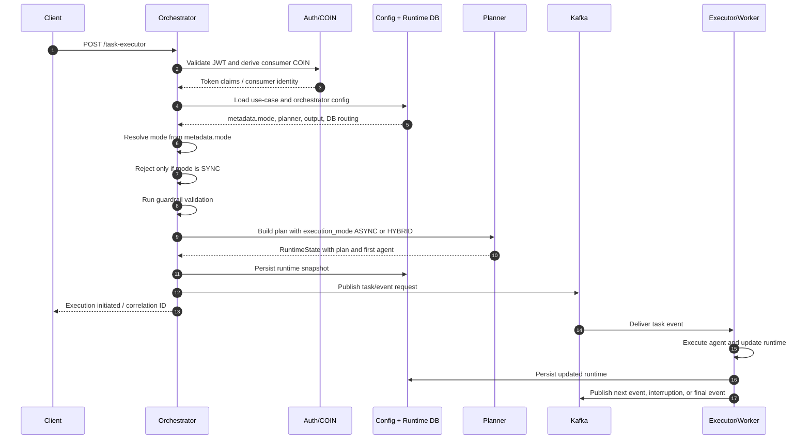
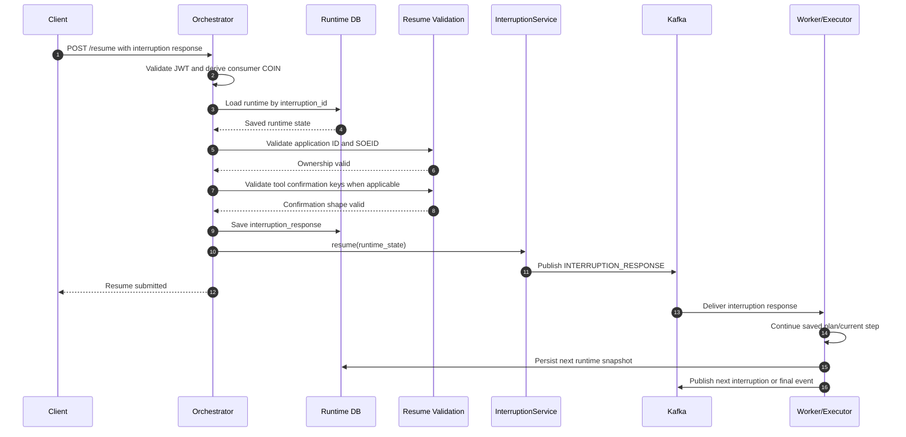
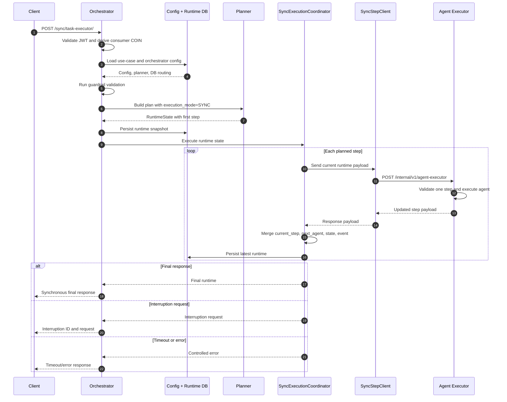
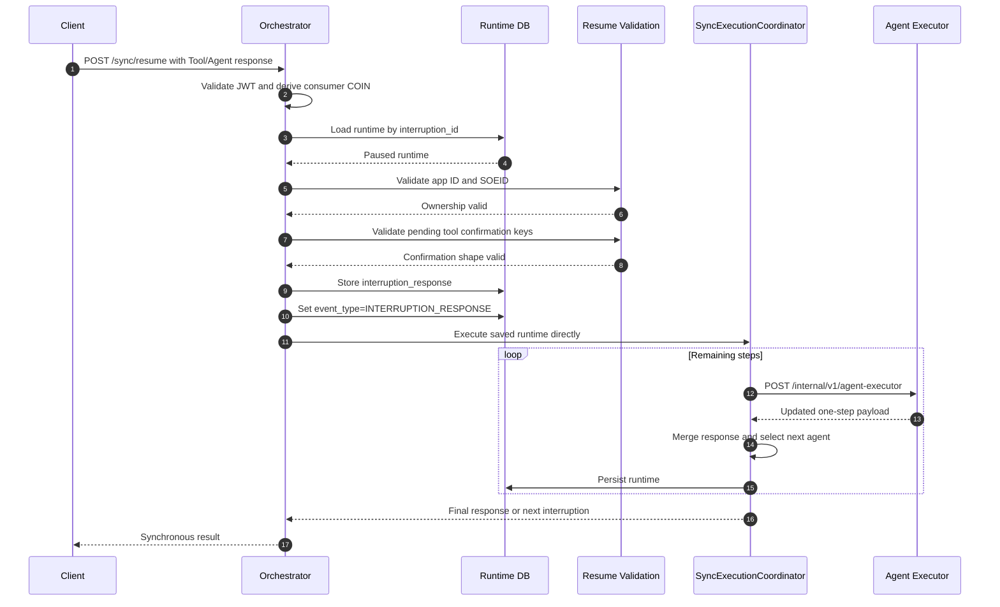

# Agentic Execution Modes: Async, Sync, Hybrid, and Resume

**Document type:** Confluence-ready technical page  
**Audience:** Developers, QA, support, and deployment teams  
**Scope:** Previous asynchronous execution, the modified synchronous execution path, resume behavior, and database configuration  
**Primary services:** Agentic Orchestrator and Agent Executor

## 1. Purpose

This page explains the execution flow from the original asynchronous implementation to the current synchronous implementation. It describes:

- how an asynchronous task starts;
- how an asynchronous interruption is resumed through `/resume`;
- how a synchronous task runs step by step through the executor;
- how a synchronous interruption is resumed through `/sync/resume`;
- how `ASYNC`, `SYNC`, and `HYBRID` modes are selected;
- which API was removed from the sync group;
- which configuration belongs in the database and which configuration is still process-level `.env` configuration;
- how to configure and manually validate each mode.

## 2. Executive Summary

There are two different execution transports:

| Transport | Start API | Resume API | Step delivery |
|---|---|---|---|
| Event-driven | `/task-executor` or conversational async APIs | `/resume` | Kafka/events |
| Direct synchronous | `/sync/task-executor/` | `/sync/resume` | HTTP call to executor for one step at a time |

The operational mode is stored in:

```text
orchestrator_config.metadata.mode
```

The valid values are:

```text
ASYNC
SYNC
HYBRID
```

The normal `/task-executor` route reads this database-backed mode. The `/sync/task-executor/` route is explicitly synchronous and passes `ExecutionMode.SYNC` to the planner regardless of the stored mode.

The most important rule is:

```text
/task-executor       -> /resume
/sync/task-executor  -> /sync/resume
```

The two resume APIs are not interchangeable.

## 3. Previous Flow: Async Execution

### 3.1 Async start

The original flow is event-driven. The client submits a task, the orchestrator creates a plan and runtime state, and the workflow continues through Kafka/event processing.



### 3.2 Async start in simple terms

1. The client asks the orchestrator to start work.
2. The orchestrator validates the caller and finds the configuration.
3. The planner decides which agents are needed.
4. The runtime state is saved so the task can be recovered.
5. The orchestrator publishes an event instead of waiting for every agent step.
6. Workers consume the event and continue the workflow.
7. The client receives the result later through the normal event/result mechanism.

### 3.3 Async payload model

The initial request normally contains the business context and state:

```json
{
  "context": "<business question or task>",
  "state": {}
}
```

The planner creates a runtime payload containing the important execution fields:

```json
{
  "usecase_id": "<Config-ID>",
  "event_type": "AGENT_EXECUTION_REQUEST",
  "session_id": "<session-id>",
  "x_correlation_id": "<correlation-id>",
  "x_application_id": "<application-id>",
  "x_soeid": "<user-id>",
  "plan": {
    "steps": []
  },
  "current_step": 0,
  "next_agent": "<agent-name>",
  "execution_mode": "ASYNC",
  "state": {}
}
```

For hybrid execution, the same field is:

```json
"execution_mode": "HYBRID"
```

## 4. Previous Flow: Async Interruption and `/resume`

### 4.1 When an async interruption occurs

An agent can pause when it needs a tool confirmation, human input, or another interruption response. The worker saves the current runtime before returning the interruption request.

The saved runtime should preserve:

```text
runtime id
interruption id
plan
current_step
next_agent
execution_mode
interruption_request
interruption_cursor
application ID
SOEID
session ID
```

The client receives an interruption response containing the interruption ID. The client must not create a new task to answer the interruption.

### 4.2 Async `/resume` sequence



### 4.3 Async `/resume` in simple terms

1. The client sends the answer to `/resume`.
2. The orchestrator finds the paused task using the interruption ID.
3. It checks that the same application and user are answering it.
4. It checks the tool confirmations when the interruption is a tool confirmation.
5. It saves the answer in the runtime.
6. It publishes an `INTERRUPTION_RESPONSE` event.
7. The worker receives the event and continues through Kafka.

`/resume` does not call the direct synchronous executor loop.

## 5. Current Flow: Synchronous Execution

### 5.1 Sync start: `/sync/task-executor/`

The sync route uses the same authentication, configuration, guardrail, and planning stages as the async route. The difference begins after planning: the coordinator waits for each step and calls the executor directly over HTTP.



### 5.2 Sync start in simple terms

1. The client calls the sync route.
2. The orchestrator creates the plan and saves it.
3. The coordinator sends one step to the executor.
4. The executor runs one agent and returns the updated state.
5. The coordinator sends the next step.
6. This repeats in the same request until completion, interruption, or timeout.

### 5.3 Sync executor contract

The confirmed executor endpoint is:

```text
POST /internal/v1/agent-executor
```

The orchestrator sends the complete current runtime payload. The internal executor uses `execution_mode` from that payload and executes exactly one planned step.

The response must preserve enough information for the coordinator to continue:

```json
{
  "x_correlation_id": "<correlation-id>",
  "current_step": 1,
  "next_agent": "<next-agent>",
  "event_type": "AGENT_EXECUTION_REQUEST",
  "plan": {
    "steps": []
  },
  "state": {},
  "interruption": null,
  "error": null
}
```

The internal request also requires a valid COIN authorization header:

```text
X-Authorization-Coin: Bearer <fresh-executor-token>
```

The sync client obtains this token from the configured sync executor COIN scope. A token copied from an old Swagger request can produce `401 ER003`.

## 6. Current Flow: Synchronous Interruption and `/sync/resume`

### 6.1 Sync interruption

When a direct executor step pauses, the coordinator returns the interruption request to the client. The runtime is already saved and contains the plan and the exact next step.

The caller must use:

```text
POST /sync/resume
```

### 6.2 Sync resume sequence



### 6.3 Sync resume in simple terms

1. The client sends the answer with the interruption ID.
2. The orchestrator loads the paused runtime.
3. It verifies the application and user.
4. It verifies tool confirmation keys if needed.
5. It saves the answer and changes the event type to `INTERRUPTION_RESPONSE`.
6. It does not create a new plan.
7. It continues from the saved `current_step` and `next_agent`.
8. The direct executor loop runs again until completion or another interruption.

## 7. The Three Execution Modes

### 7.1 ASYNC

`ASYNC` is the existing event-driven mode.

```text
Client -> /task-executor -> planner -> runtime DB -> Kafka -> worker/executor
                                                ^
                                                |
                                      /resume --+
```

Behavior:

- Start with `/task-executor`.
- Execution is initiated without waiting for every agent step.
- Kafka/event processing continues the workflow.
- Resume through `/resume`.
- The normal route defaults to `ASYNC` if `metadata.mode` is absent.
- HIL is compatible with the existing async flow, subject to the use-case policy.

### 7.2 SYNC

`SYNC` is the direct HTTP roundtrip mode.

```text
Client -> /sync/task-executor/ -> coordinator -> executor step 1
                                      ^              |
                                      |              v
                                      +-------- executor step 2 ...

Interruption -> /sync/resume -> saved runtime -> coordinator -> executor
```

Behavior:

- Start with `/sync/task-executor/`.
- The route explicitly passes `ExecutionMode.SYNC` to the planner.
- The coordinator calls the executor once per step.
- The client waits for a final response or interruption response.
- Resume through `/sync/resume`.
- The planner is not called again during resume.
- The coordinator continues from the saved runtime.
- `SYNC_EXECUTOR_URL`, COIN scope, and timeout must be valid.

### 7.3 HYBRID

`HYBRID` is accepted by the normal task route and is represented in the runtime as:

```text
execution_mode=HYBRID
```

The latest route code allows `HYBRID` through `/task-executor`, while rejecting `SYNC` there. The exact choice between event-driven and direct behavior after planning is planner/use-case behavior and must be verified for each hybrid use case.

Behavior:

- Start with `/task-executor`.
- Set `orchestrator_config.metadata.mode=HYBRID`.
- Do not use `/sync/task-executor/` to select hybrid behavior; that route forces `SYNC`.
- Resume through `/resume` if the workflow is using the event-driven path.
- If a specific hybrid implementation uses a direct continuation, document that use case explicitly and test its resume route.
- The current shared sync eligibility check rejects `HYBRID` when HIL is enabled. This must be confirmed as an intentional product rule.

### 7.4 Mode decision diagram

```mermaid
flowchart TD
    A[Incoming request] --> B{Which start API?}
    B -->|/sync/task-executor/| C[Force execution_mode=SYNC]
    B -->|/task-executor| D[Read orchestrator_config.metadata.mode]
    D --> E{Mode present?}
    E -->|No| F[Default ASYNC]
    E -->|Yes| G{Mode value}
    G -->|ASYNC| H[Kafka/event flow]
    G -->|HYBRID| I[Hybrid planner/use-case flow]
    G -->|SYNC| J[Reject normal async route]
    C --> K[Direct SyncExecutionCoordinator]
    F --> H
    H --> L[/resume for interruption]
    I --> M[Use documented hybrid behavior]
    M --> N[Resume route depends on selected transport]
    K --> O[Direct executor HTTP calls]
    O --> P[/sync/resume for interruption]
```

## 8. API Changes From Previous to Current Flow

### 8.1 Conversational API removed from sync group

The sync conversational route shown in the earlier implementation was:

```text
/sync/conversational-task-executor
```

That route is commented out/removed in the latest orchestrator code.

The corresponding normal conversational route still exists:

```text
/conversation-task-executor
```

It belongs to the normal async/hybrid route family and resolves the mode from `orchestrator_config.metadata.mode`. The latest code also shows a native sync conversational route:

```text
/sync/native-conversational-task-executor/
```

Therefore, do not document `/sync/conversational-task-executor` as an available API. Use `/conversation-task-executor` for the normal async/hybrid conversational flow, or the explicitly supported native sync route where applicable.

### 8.2 API matrix

| API | Current status | Mode/transport | Resume path |
|---|---|---|---|
| `/task-executor` | Available | ASYNC or HYBRID; SYNC rejected | `/resume` |
| `/sync/task-executor/` | Available | Forces SYNC | `/sync/resume` |
| `/conversation-task-executor` | Available | Normal async/hybrid family | `/resume` |
| `/sync/conversational-task-executor` | Removed/commented | Do not use | Not applicable |
| `/sync/native-conversational-task-executor/` | Available in latest code | Explicit sync native flow | Use the supported sync resume contract |
| `/resume` | Available | Event-driven interruption resume | Kafka/interruption service |
| `/sync/resume` | Available | Direct sync interruption resume | Sync coordinator/executor |
| `/internal/v1/agent-executor` | Available internally | Exactly one direct executor step | Called by coordinator |

## 9. Database Configuration

### 9.1 Authoritative mode configuration

For every use case, configure the orchestrator configuration object with:

```json
{
  "usecase_id": "<use-case-id>",
  "metadata": {
    "mode": "ASYNC",
    "is_human_in_loop_enabled": false,
    "database_parameters": {
      "db_name": "<runtime-database>",
      "db_schema": "<runtime-schema>"
    }
  }
}
```

Use one of:

```text
metadata.mode=ASYNC
metadata.mode=SYNC
metadata.mode=HYBRID
```

The model normalizes case and whitespace, but uppercase values should be used in database records for operational clarity.

### 9.2 Configuration responsibilities by logical database object

The exact physical JSON column name must follow the configuration loader, but the logical ownership should be:

| Logical object | Required data | Used by |
|---|---|---|
| `orchestrator_config` | `usecase_id`, `metadata.mode`, HIL flag, database parameters, planner metadata, output metadata, model metadata | Orchestrator mode resolution, planning, output construction, resume DB routing |
| `agentic_usecase_config` | Use-case identity, agent/use-case details, response configuration, Kafka topic, common-config flag, agent metadata | Use-case lookup, async event configuration, agent selection |
| Agent configuration | Agent name, implementation/model/tool metadata, endpoint or executor metadata where supported | Planner and executor |
| Runtime store | Runtime ID, session ID, JSON runtime state, timestamps | Pause/recovery/resume |

### 9.3 Runtime table

The latest runtime store shows these columns:

| Table | Column | Required purpose |
|---|---|---|
| `runtime` | `id` | Runtime/resume lookup identifier |
| `runtime` | `session_id` | Session association and index |
| `runtime` | `runtime_state` | JSON state containing plan, mode, interruption, current step, and next agent |
| `runtime` | `created_at` | Creation timestamp |
| `runtime` | `updated_at` | Last state update timestamp |

The mode is inside `runtime.runtime_state.execution_mode`; it is not a separate runtime table column.

### 9.4 Recommended async database record

```json
{
  "usecase_id": "<use-case-id>",
  "metadata": {
    "mode": "ASYNC",
    "is_human_in_loop_enabled": false,
    "database_parameters": {
      "db_name": "<runtime-database>",
      "db_schema": "<runtime-schema>"
    }
  },
  "planner_metadata": {
    "planner_type": "<planner-type>",
    "dynamic_subagent_selection": false
  },
  "output_metadata": {
    "<required-output-settings>": "<value>"
  }
}
```

### 9.5 Recommended sync database record

Use the same configuration shape, but set:

```json
{
  "metadata": {
    "mode": "SYNC",
    "is_human_in_loop_enabled": false,
    "database_parameters": {
      "db_name": "<runtime-database>",
      "db_schema": "<runtime-schema>"
    }
  }
}
```

The `SYNC` value keeps the database configuration consistent with the route, although `/sync/task-executor/` currently forces `SYNC` in code.

### 9.6 Recommended hybrid database record

```json
{
  "metadata": {
    "mode": "HYBRID",
    "is_human_in_loop_enabled": false,
    "database_parameters": {
      "db_name": "<runtime-database>",
      "db_schema": "<runtime-schema>"
    }
  }
}
```

Use `/task-executor` for this record. Do not expect `/sync/task-executor/` to preserve `HYBRID`; it currently forces `SYNC`.

### 9.7 Kafka/use-case database values

For async and hybrid use cases, the use-case response configuration must contain the values required by the existing event flow, such as:

```yaml
kafka:
  topic: <use-case-topic>
  is_common_config: true
  bootstrap_servers:
    - <broker-1>:9095
    - <broker-2>:9095
executor:
  # Keep only fields actually consumed by the current loader.
  # This is not the authoritative execution-mode location.
```

The topic, bootstrap servers, TLS configuration, consumer group, and event naming must match the deployed Kafka configuration. Do not copy production credentials into this page.

## 10. Configuration That Is Still Not Database-Driven

The per-use-case mode and routing metadata are database-driven. The following values are still shown as process-level environment or secret-file configuration in the current implementation:

```dotenv
SYNC_EXECUTOR_URL=http://<executor-host>:<port>/internal/v1/agent-executor
SYNC_EXECUTOR_COIN_SCOPE=<sync-executor-coin-scope>
SYNC_OVERALL_TIMEOUT_SECONDS=120
```

The services also require their existing process-level configuration for items such as:

- COIN endpoint, provider role, JWKS paths, and credential paths;
- Kafka TLS files and bootstrap connection settings;
- database/PGVector credentials and certificate paths;
- model or Vertex AI endpoint and project values;
- logging configuration;
- local secret directories.

If the target deployment requires every sync value to be stored in the database, the code must add a database-backed sync transport configuration model and loader. Setting `SYNC_EXECUTOR_URL` only in a database row will not affect the current `SyncExecutionCoordinator` unless the environment/configuration provider is changed to read it there.

## 11. Reload and Deployment Procedure

1. Update the authoritative `orchestrator_config.metadata.mode` record.
2. Update use-case, planner, output, agent, database-routing, and Kafka values required by the selected use case.
3. Confirm the runtime database/schema points to the database containing the `runtime` table.
4. Confirm the orchestrator environment contains valid sync transport values for sync tests.
5. Confirm the executor exposes `/internal/v1/agent-executor` and accepts the COIN token.
6. Call the orchestrator `/reload-configs` endpoint or restart the service.
7. Start a new request with a new correlation ID.
8. Verify the loaded configuration, rather than relying only on the database editor view.
9. Verify the runtime JSON contains the expected `execution_mode`.

## 12. Manual Validation Scenarios

### 12.1 Async success

1. Set `metadata.mode=ASYNC`.
2. Reload configuration.
3. Call `/task-executor`.
4. Confirm the runtime mode is `ASYNC`.
5. Confirm an event is published and the request returns an initiation response.
6. Confirm the final result arrives through the event-driven flow.

### 12.2 Async interruption and resume

1. Use an async use case that requires tool or human input.
2. Call `/task-executor`.
3. Record `interruption_id` and runtime state.
4. Call `/resume` with the interruption response.
5. Confirm the runtime response is saved.
6. Confirm `INTERRUPTION_RESPONSE` is published.
7. Confirm the worker resumes the saved plan.

### 12.3 Sync success

1. Set `metadata.mode=SYNC`.
2. Confirm `SYNC_EXECUTOR_URL` ends in `/internal/v1/agent-executor`.
3. Confirm the executor COIN scope and token are valid.
4. Call `/sync/task-executor/`.
5. Confirm one HTTP executor request occurs for each planned step.
6. Confirm the final response is returned from the same request.

### 12.4 Sync interruption and resume

1. Use a sync use case that pauses.
2. Call `/sync/task-executor/`.
3. Record `interruption_id`, `current_step`, `next_agent`, and mode.
4. Call `/sync/resume` with the matching response.
5. Confirm the planner is not called again.
6. Confirm the coordinator starts from the saved step.
7. Confirm the executor continues through HTTP.
8. Confirm the final result or next interruption.

### 12.5 Hybrid

1. Set `metadata.mode=HYBRID`.
2. Disable HIL for the first test.
3. Reload configuration.
4. Call `/task-executor`, not `/sync/task-executor/`.
5. Confirm runtime mode is `HYBRID`.
6. Record whether the selected use case uses Kafka, direct HTTP, or a planner-specific combination.
7. Repeat with HIL enabled and confirm the expected eligibility behavior.

## 13. Error and Risk Checks

| Check | Expected behavior |
|---|---|
| Missing/expired client token | `401`; no planning or executor call |
| Invalid internal COIN token | `401`; downstream status should remain visible in logs |
| Missing use-case config | Controlled configuration error, not an unexplained generic failure |
| `metadata.mode` missing | Normal route defaults to `ASYNC`; runtime mode must not be `None` |
| Normal route with `SYNC` | Rejected with a clear execution-mode error |
| Sync route with DB mode `ASYNC` or `HYBRID` | Still executes as `SYNC` because the route forces it |
| Missing runtime on resume | Controlled resumability error |
| Wrong application ID or SOEID | Resume rejected before continuation |
| Tool confirmation key mismatch | `AP011`-type validation failure; no continuation |
| Executor step timeout | Controlled `ER006`-type timeout |
| Overall sync timeout | No further step dispatch after deadline |
| Invalid current step | Executor rejects the payload before agent execution |
| Duplicate resume | Must be explicitly idempotent or rejected; must not duplicate business action |
| Service restart between interruption and resume | Runtime must be recoverable from the database |

## 14. Known Design Constraints

1. `/sync/task-executor/` is a transport-specific API, not a generic mode selector.
2. `/sync/resume` is the sync continuation API; `/resume` is the normal event-driven continuation API.
3. The normal endpoint resolves mode from `orchestrator_config.metadata.mode`.
4. The executor receives the mode in the request payload and currently has an async default if the field is omitted. Sync callers must always send the field.
5. HIL eligibility currently rejects sync and hybrid modes in the shared sync eligibility check.
6. Runtime lookup during resume depends on the database name/schema resolved from the current use-case configuration.
7. Mode changes require configuration reload or service restart before new requests see them.

## 15. Completion Criteria

The deployment is ready when:

- all use cases have a verified `orchestrator_config.metadata.mode`;
- the mode is visible in the loaded in-memory configuration after reload;
- async tasks start and resume through `/resume`;
- sync tasks complete through `/internal/v1/agent-executor`;
- sync interruptions resume through `/sync/resume` without replanning;
- hybrid behavior is documented for each hybrid use case;
- the removed `/sync/conversational-task-executor` route is not used by clients;
- runtime rows contain a non-null execution mode;
- application/user/confirmation checks are tested;
- duplicate resume behavior is defined;
- no live credentials or bearer tokens are stored in this page or test evidence.

