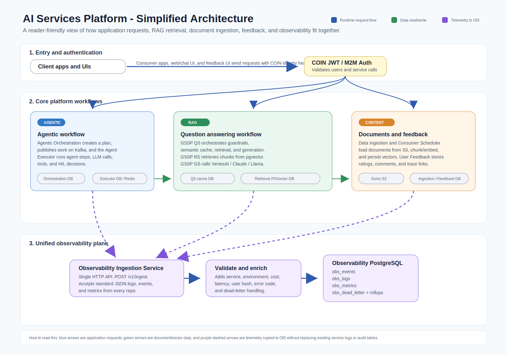
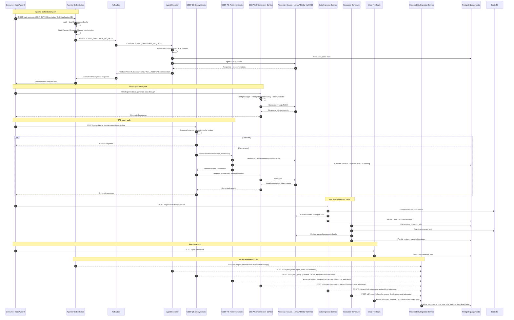
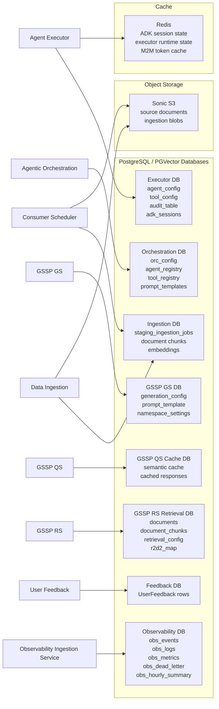

# Unified Application Architecture — AI Services Platform

> Combined architecture synthesised from the root design docs and the eight service-folder diagrams/screenshots.
> The diagram separates the **current application/runtime flow** from the **target observability flow** where every repo emits logs, events, and metrics as standard JSON to the Observability Ingestion Service.

---

## Simplified Architecture Image

This is the reader-friendly view. It groups the platform into four ideas:

- **Entry/authentication:** client apps and UIs enter through COIN JWT / M2M authentication.
- **Core workflows:** agentic orchestration, RAG question answering, document ingestion, and feedback each have a clear lane.
- **Data stores:** service-owned PostgreSQL/PGVector, Redis, and Sonic S3 remain close to the services that own them.
- **Observability plane:** every service sends normalized JSON logs, events, and metrics to OIS, which validates/enriches and writes to observability PostgreSQL.

## Detailed Reference Diagram

```mermaid
flowchart TB

    subgraph CLIENTS["Client Applications"]
        CA["Consumer Apps\nCitiConnect / CitiDirect / DDO / Pega / Stellar"]
        WEBUI["Web UI / Chat"]
        FBUI["Feedback UI"]
    end

    subgraph AUTH_LAYER["Authentication Layer"]
        COIN["COIN JWT / OAuth2\nBearer Token Validation"]
        M2M["M2M Token Roller\nOutbound R2D2 / LLM calls"]
    end

    subgraph ORCH["Agentic Orchestration Service\norchestration/main.py - FastAPI"]
        direction TB
        OMID["Middleware\nCORS + CorrelationID\nHTTP request/response logging"]
        OAPI["API Layer\nPOST /task-executor\nPOST /conversational-task-executor\nPOST /native-conversational-task-executor\nGET /execution-status\nGET /registered-agents\nPOST /reload-configs"]
        OPLANNER["Planner Layer\nStaticPlanner / DynamicPlanner\nreads OrchestratorConfig from DB\noptional VertexAI/Stellar call"]
        OMSG["Message Processing Service\nAGENT_EXECUTION_FINAL_RESPONSE\nAGENT_EXECUTION_REJECTED\nEXECUTION_REJECTED\nHIL_RESPONSE"]
        ORESP["Response Service\nWebhook or Kafka delivery to client"]
    end

    subgraph KAFKA_BUS["Internal Kafka Bus"]
        direction LR
        K_AER["AGENT_EXECUTION_REQUEST"]
        K_AEFR["AGENT_EXECUTION_FINAL_RESPONSE"]
        K_HIL["HIL_REQUEST / HIL_RESPONSE"]
        K_ALERT["CLIENT_ALERT"]
        K_EXEC_REJ["EXECUTION_REJECTED"]
    end

    subgraph EXEC["Agent Executor\nexecutor/main.py - FastAPI"]
        direction TB
        EMID["Middleware\nCorrelationIDMiddleware"]
        EAPI["API\nGET /audit/sub-executions/{corr_id}/{agent}\nPOST /reload-config"]
        EKAFKA["KafkaConsumerService\nprocess_message()"]
        EMSG["MessageProcessingService\nEvent-type routing\nAGENT_EXECUTION_REQUEST\nAGENT_HIL_RESPONSE"]
        EORCH["AgentOrchestrator\nper-step coordinator"]
        EEXEC["AgentExecutionService\nSessionManager + ADK Runner\nDlLoggerPlugin\nReflectAndRetryToolPlugin"]
        EPROD["KafkaProducerService\nPublish result / HIL / rejection"]
    end

    subgraph GSSP_QS["GSSP Query Service (gssp-qs)\nFastAPI"]
        direction TB
        QSAPI["API\nPOST /query-data\nPOST /conversational-query-data"]
        QSPIPE["execute_pipeline.py\nRAG workflow orchestration"]
        QSGUARD["Guardrail Client\nLakera + profanity"]
        QSCACHE["Semantic Cache\nPGVector-backed cache"]
        QSRETCLIENT["Retrieval Client\ncalls GSSP RS"]
        QSGENCLIENT["Generation Client\ncalls GSSP GS"]
    end

    subgraph GSSP_RS["GSSP Retrieval Service (gssp-rs)\nquery/main.py - FastAPI"]
        direction TB
        RSAPI["API\nPOST /api/gssp-retrieval-service/v1/retrieve\nPOST /api/gssp-retrieval-service/v1/retrieve_embedding\nPOST /reload-configs"]
        RSCFG["ConfigManager\nconsumer_cfg + retrieval_config"]
        RSEMB["EmbedFactory\nStellar / VertexAI embeddings"]
        RSPGV["PGVectorRetriever\nsemantic / lexical / hybrid retrieval"]
        RSMMR["MMR Re-ranking\nmaximal marginal relevance"]
    end

    subgraph GSSP_GS["GSSP Generic Generation Service (gssp-gs)\nquery/main.py - FastAPI"]
        direction TB
        GSMID["Middleware\nCorrelationIDMiddleware\nCORS\nHTTP intercept"]
        GSAPI["API\nPOST /generate\nPOST /generate-pass-through\nPOST /encode-parts\nPOST /reload-configs\nPOST /reload-parts"]
        GSFACT["Factory Layer\nConfigManager\nPromptTemplateFactory\nGeneratorFactory"]
        GSPB["PromptBinder\nLangChain template binding"]
        GSPART["PartHolder\nfilename + mime_type + base64 data\nmultimodal request parts"]
    end

    subgraph LLM_LAYER["LLM / Model Layer"]
        VERTEX["VertexAI Gemini"]
        CLAUDE["Anthropic Claude"]
        LLAMA["Llama / DragonIQ"]
        STELLAR["Stellar embeddings"]
        R2D2["R2D2 AI Proxy\nInternal LLM Gateway"]
    end

    subgraph INGESTION["Document Ingestion"]
        direction TB
        DIAPI["Data Ingestion Service\nPOST /ingest/bulk-change/create\nGET /ingest/bulk-change/{job_id}/status"]
        DIFACT["IngestionFactory\nTenant discovery"]
        DIPIPE["Ingestion Pipeline\nS3 download\nSplit -> Embed -> Persist pgvector\nDelete document/chunks"]
        CSAPI["Consumer Service / Scheduler\nPOST /scheduler/start|stop|status\nPOST /manual_ingest_run"]
        CSSCHED["APScheduler\npolls staging_ingestion_jobs every 20s"]
        CSJOB["IngestionJobExecutor\nper-job thread + timeout checker"]
        CSTEN["BaseTenant.ingest()\nUPSERT / DELETE pipeline"]
    end

    subgraph FB_SVC["User Feedback Service\nFastAPI"]
        FBAPI["API\nPOST /api/v1/feedback"]
        FBAUTH["JWTBearer\nCOIN token validation"]
        FBREPO["UserFeedbackRepo.create()\nInsert feedback record"]
        FBSTORE["Feedback Store\nrating, thumbs, comments,\nmetadata, trace/correlation fields"]
    end

    subgraph DATA_STORES["Platform Data Stores"]
        direction TB
        PG_ORCH["PostgreSQL\nOrchestration config\norc_config, agent_registry,\ntool_registry, prompt_templates"]
        PG_EXEC["PostgreSQL / PGVector\nExecutor\naudit_table, agent_config,\ntool_config, adk_sessions"]
        PG_GS["PostgreSQL\nGSSP GS\ngeneration_config,\nprompt_template, namespace settings"]
        PG_QS["PostgreSQL / PGVector\nQS semantic cache"]
        PG_RS["PostgreSQL / pgvector\nGSSP RS\ndocuments, document_chunks,\nretrieval_config, r2d2_map"]
        PG_ING["PostgreSQL / pgvector\nstaging_ingestion_jobs,\ndocument chunks, embeddings"]
        PG_FB["PostgreSQL / PGVector\nUserFeedback table"]
        S3["Sonic S3\nSource documents\nIngestion blobs"]
        REDIS_EXEC["Redis\nExecutor session/runtime state"]
    end

    subgraph OBS_CURRENT["Current Observability Hooks - Fragmented"]
        direction TB
        OBS_LOG["JSON logs\ncorrelation_id, application_id, SOE_ID"]
        OBS_AUDIT["Executor audit_table\nINVOCATION / AGENT / LLM / TOOL / ERROR"]
        OBS_KAFKA["Kafka lifecycle events\nAgent Executor + Orchestration only"]
        OBS_HTTP["HTTP middleware timing\nmostly seconds/string"]
        OBS_TOKEN["LLMUsageMetrics\nGSSP GS + Agent Executor tokens"]
    end

    subgraph OBS_TARGET["Target Observability Plane"]
        direction TB
        OIS["Observability Ingestion Service\nPOST /v1/ingest\nPOST /v1/ingest/batch\nstandard JSON logs + events + metrics"]
        OISVAL["Validation + Enrichment\nschema_version, service_name,\nenvironment, user_hash, cost, latency"]
        OISPG["PostgreSQL\nobs_events\nobs_logs\nobs_metrics\nobs_dead_letter\nobs_hourly_summary"]
    end

    %% Client and orchestration flow
    CA --> COIN
    WEBUI --> COIN
    COIN --> OMID
    OMID --> OAPI
    OAPI --> OPLANNER
    OPLANNER --> K_AER
    OPLANNER --> K_HIL
    K_AEFR --> OMSG
    K_HIL --> OMSG
    K_EXEC_REJ --> OMSG
    OMSG --> ORESP
    ORESP --> CA

    %% Executor flow
    K_AER --> EKAFKA
    K_HIL --> EKAFKA
    EKAFKA --> EMSG
    EMSG --> EORCH
    EORCH --> EEXEC
    EEXEC --> EPROD
    EPROD --> K_AEFR
    EPROD --> K_EXEC_REJ
    EEXEC --> REDIS_EXEC
    EEXEC --> VERTEX
    EEXEC --> CLAUDE

    %% Query/RAG/generation flow
    COIN --> QSAPI
    QSAPI --> QSPIPE
    QSPIPE --> QSGUARD
    QSPIPE --> QSCACHE
    QSPIPE --> QSRETCLIENT
    QSRETCLIENT --> RSAPI
    RSAPI --> RSCFG
    RSAPI --> RSEMB
    RSAPI --> RSPGV
    RSPGV --> RSMMR
    QSPIPE --> QSGENCLIENT
    QSGENCLIENT --> GSAPI

    %% Direct GS flow
    COIN --> GSMID
    GSMID --> GSAPI
    GSAPI --> GSFACT
    GSAPI --> GSPART
    GSFACT --> GSPB
    GSPB --> VERTEX
    GSPB --> CLAUDE
    GSPB --> LLAMA
    RSEMB --> STELLAR
    RSEMB --> VERTEX
    VERTEX --> R2D2
    CLAUDE --> R2D2
    LLAMA --> R2D2
    STELLAR --> R2D2

    %% Ingestion flow
    COIN --> DIAPI
    DIAPI --> DIFACT
    DIFACT --> DIPIPE
    DIPIPE --> S3
    DIPIPE --> PG_ING
    DIAPI --> M2M
    M2M --> R2D2
    CSAPI --> CSSCHED
    CSSCHED --> CSJOB
    CSJOB --> CSTEN
    CSTEN --> S3
    CSTEN --> PG_ING

    %% Feedback flow
    FBUI --> COIN
    COIN --> FBAUTH
    FBAUTH --> FBAPI
    FBAPI --> FBREPO
    FBREPO --> FBSTORE
    FBSTORE --> PG_FB

    %% Data ownership
    OPLANNER --> PG_ORCH
    EEXEC --> PG_EXEC
    GSFACT --> PG_GS
    QSCACHE --> PG_QS
    RSCFG --> PG_RS
    RSPGV --> PG_RS

    %% Current observability hooks
    OAPI -. logs .-> OBS_LOG
    EEXEC -. audit .-> OBS_AUDIT
    EPROD -. kafka lifecycle .-> OBS_KAFKA
    GSAPI -. http + token logs .-> OBS_HTTP
    QSPIPE -. request/cache/error logs .-> OBS_LOG
    RSAPI -. request/retrieval init logs .-> OBS_LOG
    DIAPI -. job/http logs .-> OBS_LOG
    CSJOB -. job/scheduler logs .-> OBS_LOG
    FBAPI -. middleware logs .-> OBS_LOG
    EEXEC -. token counts .-> OBS_TOKEN
    GSAPI -. token counts .-> OBS_TOKEN

    %% Target observability path
    OAPI -. log/event/metric JSON .-> OIS
    EEXEC -. log/event/metric JSON .-> OIS
    GSAPI -. log/event/metric JSON .-> OIS
    QSPIPE -. log/event/metric JSON .-> OIS
    RSAPI -. log/event/metric JSON .-> OIS
    DIAPI -. log/event/metric JSON .-> OIS
    CSJOB -. log/event/metric JSON .-> OIS
    FBAPI -. log/event/metric JSON .-> OIS
    OIS --> OISVAL
    OISVAL --> OISPG
```

---

## Service Interaction Diagram (Sequence)

---

## Data Store Ownership Map

---

## Component Summary Table

| Component | Type | Auth | Kafka | LLM / Embedding | DB | Current Observability | Target OIS Signals |
|---|---|---|---|---|---|---|---|
| **Agentic Orchestration** | Orchestrator | COIN JWT | Producer + consumer | VertexAI/Stellar planner | PostgreSQL config | JSONFormatter, HTTP timing, Kafka control events | request/auth/plan/HIL/Kafka/final-response logs, events, metrics |
| **Agent Executor** | Execution engine | Kafka header / platform auth | Consumer + producer | VertexAI Gemini, Claude | PostgreSQL/PGVector, Redis | `DlLoggerPlugin`, `ObservabilityLogger`, audit table, token counts | agent, step, LLM, tool, audit, Kafka, latency, cost events |
| **GSSP QS** | Query/RAG orchestration | COIN JWT | None | Calls GS and RS | PGVector semantic cache | request/response/error/cache-hit logs | query, guardrail, cache-hit/miss, retrieval-client, generation-client telemetry |
| **GSSP RS** | Retrieval service | COIN JWT | None | Stellar/VertexAI embeddings via R2D2 | PostgreSQL/pgvector | HTTP request/response logs, partial config/DB/retriever logs | retrieval, embedding, MMR, PGVector query, no-result, result-quality metrics |
| **GSSP GS** | LLM gateway | COIN JWT | None | VertexAI, Claude, Llama via R2D2 | PostgreSQL config | HTTP intercept, `LLMUsageMetrics`, prompt/template logs | generation, token, cost, safety/rate-limit, multimodal file telemetry |
| **Data Ingestion** | REST document ingest | COIN JWT + M2M | None | Embedding via R2D2 | PostgreSQL/pgvector, S3 | JSON logs, job status, error codes | bulk-change, job, document parse, embedding, auth, status-query telemetry |
| **Consumer Service** | Ingestion scheduler | COIN JWT | None | Embedding via R2D2 | PostgreSQL/pgvector, S3 | JSON logs, APScheduler lifecycle, job status | scheduler, queue-depth, job, document parse, embedding telemetry |
| **User Feedback** | Feedback API | COIN JWT | None | None | PostgreSQL/PGVector | middleware logs, feedback rows | feedback submission/review/auth-failure logs, events, counters |
| **Observability Ingestion Service** | Central telemetry API | COIN JWT M2M | None for MVP | None | Observability PostgreSQL | New service | validates/enriches/persists all log/event/metric JSON |
