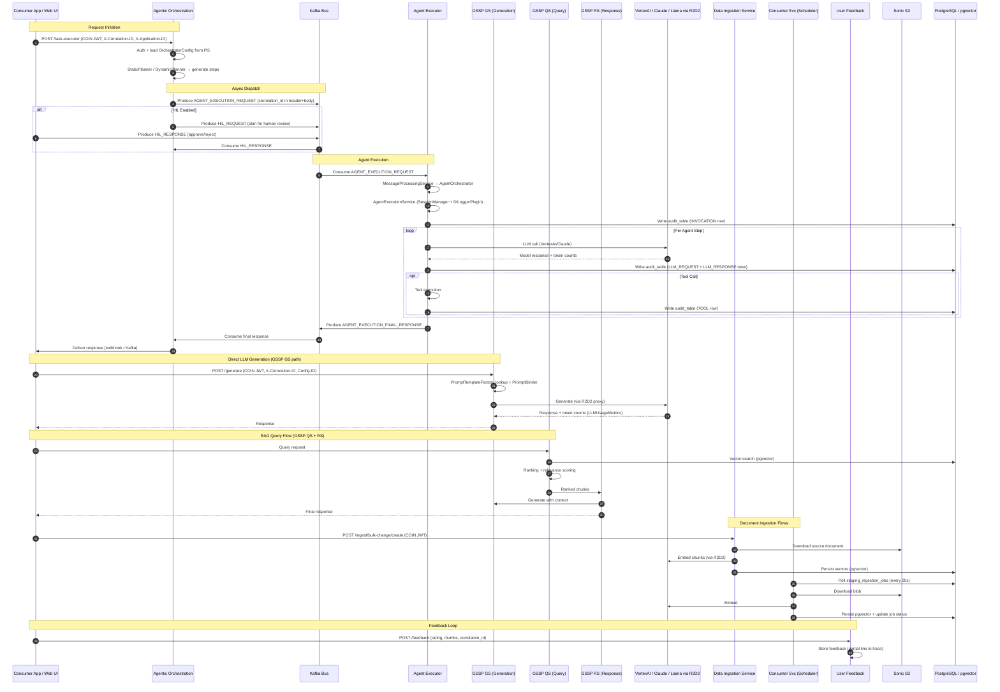
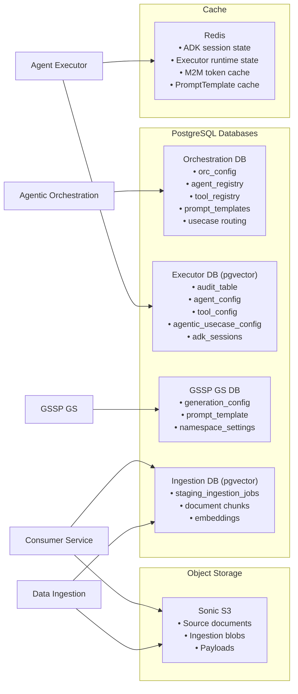

# Unified Application Architecture — AI Services Platform

> Combined architecture diagram synthesised from all eight service repositories.
> Shows the complete request flow, all service interactions, data stores, and observability hooks.

---

## High-Level Architecture Diagram

```mermaid
flowchart TB

    subgraph CLIENTS["Client Applications"]
        CA["Consumer Apps\n(CitiConnect, CitiDirect,\nDDO, Pega, Stellar)"]
        WEBUI["Web UI / Chat"]
        FBUI["Feedback UI"]
    end

    subgraph AUTH_LAYER["Authentication Layer"]
        COIN["COIN JWT / OAuth2\nBearer Token Validation"]
        M2M["M2M Token Roller\n(Outbound R2D2 / LLM calls)"]
    end

    subgraph ORCH["Agentic Orchestration Service\n(orchestration/main.py — FastAPI)"]
        direction TB
        OMID["Middleware\nCorrelationIDMiddleware\nCORSMiddleware\nHTTP Interceptor"]
        OAPI["API Layer\nPOST /task-executor\nPOST /conversational-task-executor\nPOST /native-conversational-task-executor\nGET /execution-status\nGET /registered-agents"]
        OPLANNER["Planner Layer\nStaticPlanner / DynamicPlanner\n(reads OrchestratorConfig from DB)"]
        OMSG["Message Processing Service\nAGENT_EXECUTION_FINAL_RESPONSE\nAGENT_EXECUTION_REJECTED\nEXECUTION_REJECTED\nHIL_RESPONSE"]
        ORESP["Response Service\nWebhook / Kafka delivery"]
    end

    subgraph KAFKA_BUS["Internal Kafka Bus"]
        direction LR
        K_AER["AGENT_EXECUTION_REQUEST\ntopic"]
        K_AEFR["AGENT_EXECUTION_FINAL_RESPONSE\ntopic"]
        K_HIL["HIL_REQUEST / HIL_RESPONSE\ntopic"]
        K_ALERT["CLIENT_ALERT\ntopic"]
        K_EXEC_REJ["EXECUTION_REJECTED\ntopic"]
    end

    subgraph EXEC["Agentic Agent Executor\n(executor/main.py — FastAPI)"]
        direction TB
        EMID["Middleware\nCorrelationIDMiddleware"]
        EAPI["API\nGET /audit/sub-executions/{corr_id}/{agent}\nPOST /reload-config"]
        EKAFKA["KafkaConsumerService\nprocess_message()"]
        EMSG["MessageProcessingService\nEvent-type routing\nAGENT_EXECUTION_REQUEST\nAGENT_HIL_RESPONSE"]
        EORCH["AgentOrchestrator\n(per-step coordinator)"]
        EEXEC["AgentExecutionService\nSessionManager\nADK App\n+ DlLoggerPlugin\n+ ReflectAndRetryToolPlugin\n+ Runner"]
        EPROD["KafkaProducerService\nPublish result / next step"]
    end

    subgraph GSSP_GS["GSSP Generic Generation Service\n(query/main.py — FastAPI)"]
        direction TB
        GSMID["Middleware\nCorrelationIDMiddleware\nCORSMiddleware\nHTTP Interceptor"]
        GSAPI["API\nPOST /generate\nPOST /generate-pass-through\nPOST /reload-config\nPOST /reload-parts"]
        GSFACT["Factory Layer (Hot-reload)\nConfigManager\nPromptTemplateFactory\nGeneratorFactory"]
        GSPB["PromptBinder\nLangChain template binding"]
    end

    subgraph GSSP_QS["GSSP Query Service\n(FastAPI)"]
        direction TB
        QSAPI["API\nQuery / Search endpoints"]
        QSRET["Retriever\nVector search + ranking"]
        QSRANK["Reranker\nRelevance scoring"]
    end

    subgraph GSSP_RS["GSSP Response Service\n(FastAPI)"]
        direction TB
        RSAPI["API\nResponse endpoints"]
        RSASM["Response Assembler\nContext + generation merge"]
        RSSCORE["Confidence Scorer"]
    end

    subgraph LLM_LAYER["LLM / Model Layer"]
        VERTEX["VertexAI Gemini\nAsyncVertexAIGenerator"]
        CLAUDE["Anthropic Claude\nAsyncAnthropic / AsyncOpenAI"]
        LLAMA["Llama / DragonIQ\ngenai-common → VertexAIGenerator"]
        R2D2["R2D2 AI Proxy\n(Internal LLM Gateway)"]
    end

    subgraph DI_SVC["Data Ingestion Service\n(FastAPI — COIN JWT)"]
        direction TB
        DIAPI["API\nPOST /ingest/bulk-change/create\nGET /ingest/bulk-change/{job_id}/status\nGET /ready"]
        DIFACT["IngestionFactory\nTenant discovery (dynamic)"]
        DITEN["Tenants\nSalesAcceleratorTenant\nCoCDocumentTenant\nDefaultTenant"]
        DIPIPE["Ingestion Pipeline\nDownload S3 blob\nSplit → Embed → Persist pgvector\nDELETE: remove doc + chunks"]
    end

    subgraph CS_SVC["Consumer Service / Ingestion Scheduler\n(FastAPI + APScheduler)"]
        direction TB
        CSAPI["API\nPOST /scheduler/start|stop|status\nPOST /manual_ingest_run"]
        CSSCHED["IngestionScheduler\n(polls every 20s)\nQueries staging_ingestion_jobs\nNOT_STARTED → thread dispatch"]
        CSJOB["IngestionJobExecutor\nper-job thread\n+ TimeOutChecker"]
        CSTEN["BaseTenant.ingest()\nUPSERT / DELETE pipeline"]
    end

    subgraph FB_SVC["User Feedback Service\n(FastAPI)"]
        FBAPI["API\nPOST /feedback\nGET /feedback/{id}"]
        FBSTORE["Feedback Store\nrating, thumbs, category,\nfree_text, correlation_id"]
    end

    subgraph DATA_STORES["Data Stores"]
        direction TB
        PG_ORCH["PostgreSQL\nOrchestrator\norc_config, agent_registry\ntool_registry, prompt_templates"]
        PG_EXEC["PostgreSQL (PGVector)\nExecutor\nagent_config, tool_config\nagentic_usecase_config\naudit_table, adk_sessions"]
        PG_GS["PostgreSQL\nGSSP GS\ngeneration_config\nprompt_template\nnamespace settings"]
        PG_DI["PostgreSQL (pgvector)\nData Ingestion\nstaging_ingestion_jobs\ndocument chunks + embeddings"]
        PG_CS["PostgreSQL (pgvector)\nConsumer\nstaging_ingestion_jobs\ndocument chunks + embeddings"]
        S3["Sonic S3\nSource documents\nIngestion payloads"]
        REDIS_EXEC["Redis\nSession state\nADK sessions cache"]
    end

    subgraph OBS["Observability Hooks (Current — Partial)"]
        direction TB
        OBS_LOG["ObservabilityLogger\nJSON structured logs\ncorrelation_id, application_id, soeid"]
        OBS_AUDIT["DlLoggerPlugin\nPostgreSQL audit_table\nINVOCATION, AGENT, LLM_REQUEST\nLLM_RESPONSE, TOOL, ERROR"]
        OBS_KAFKA["Kafka Event Streaming\n(optional, Agent Executor only)\ntool + agent lifecycle events"]
        OBS_HTTP["HTTP Middleware\nRequest URL, response body,\nlatency (string)"]
        OBS_ERR["Exception Handler\nerror_code, http_status"]
        OBS_TOKEN["LLMUsageMetrics\nprompt_tokens, completion_tokens,\ntotal_tokens (GSSP GS + Agent Executor)"]
    end

    %% Client → Auth → Orchestration
    CA --> COIN
    WEBUI --> COIN
    COIN --> OMID
    OMID --> OAPI
    OAPI --> OPLANNER
    OPLANNER --> K_AER
    OPLANNER --> K_HIL

    %% Orchestration ← Response flow
    K_AEFR --> OMSG
    K_HIL --> OMSG
    K_EXEC_REJ --> OMSG
    OMSG --> ORESP
    ORESP --> CA

    %% Kafka → Agent Executor
    K_AER --> EKAFKA
    K_HIL --> EKAFKA
    EKAFKA --> EMSG
    EMSG --> EORCH
    EORCH --> EEXEC
    EEXEC --> EPROD
    EPROD --> K_AEFR
    EPROD --> K_EXEC_REJ
    EEXEC --> REDIS_EXEC

    %% Agent Executor → LLM
    EEXEC --> VERTEX
    EEXEC --> CLAUDE
    VERTEX --> R2D2
    CLAUDE --> R2D2
    R2D2 -.-> LLM_LAYER

    %% GSSP GS flow
    CA --> GSMID
    GSMID --> GSAPI
    GSAPI --> GSFACT
    GSFACT --> GSPB
    GSPB --> VERTEX
    GSPB --> CLAUDE
    GSPB --> LLAMA
    LLAMA --> R2D2

    %% GSSP QS → RS
    CA --> QSAPI
    QSAPI --> QSRET
    QSRET --> QSRANK
    QSRANK --> RSASM
    RSASM --> RSSCORE

    %% Data Ingestion Service
    CA --> COIN
    COIN --> DIAPI
    DIAPI --> DIFACT
    DIFACT --> DITEN
    DITEN --> DIPIPE
    DIPIPE --> S3
    DIPIPE --> PG_DI
    DIAPI --> M2M
    M2M --> R2D2

    %% Consumer Service (Scheduler)
    CSSCHED --> CSJOB
    CSJOB --> CSTEN
    CSTEN --> S3
    CSTEN --> PG_CS

    %% Feedback
    FBUI --> COIN
    COIN --> FBAPI
    FBAPI --> FBSTORE

    %% Observability hooks
    OAPI -. logs .-> OBS_LOG
    OPLANNER -. logs .-> OBS_LOG
    OMSG -. logs .-> OBS_LOG
    EEXEC -. audit rows .-> OBS_AUDIT
    EEXEC -. kafka events .-> OBS_KAFKA
    GSMID -. logs .-> OBS_HTTP
    EEXEC -. token counts .-> OBS_TOKEN
    GSAPI -. token counts .-> OBS_TOKEN
    OAPI -. errors .-> OBS_ERR
    EEXEC -. errors .-> OBS_ERR

    %% Data store linkage
    OPLANNER --> PG_ORCH
    EEXEC --> PG_EXEC
    EEXEC --> OBS_AUDIT
    GSFACT --> PG_GS
```

---

## Service Interaction Diagram (Sequence)

---

## Data Store Ownership Map

---

## Component Summary Table

| Component | Type | Auth | Kafka | LLM | DB | Key Observability |
|---|---|---|---|---|---|---|
| **Agentic Orchestration** | Orchestrator | COIN JWT | Producer + Consumer | VertexAI/Stellar (dynamic planner) | PostgreSQL (orc_config) | JSONFormatter logs, HTTP middleware latency |
| **Agent Executor** | Execution Engine | COIN JWT (via Kafka header) | Consumer + Producer | VertexAI Gemini | PostgreSQL+pgvector (audit_table) | DlLoggerPlugin (audit), ObservabilityLogger, token counts |
| **GSSP GS** | LLM Gateway | COIN JWT | None | VertexAI, Claude, Llama via R2D2 | PostgreSQL (gen_config) | HTTP interceptor, LLMUsageMetrics, PromptTemplate binding |
| **GSSP QS** | Query/Search | COIN JWT | None | Embedding model via R2D2 | pgvector | Basic JSON logs |
| **GSSP RS** | Response Assembler | COIN JWT | None | None (assembly only) | None | Basic JSON logs |
| **Data Ingestion** | Ingest API | COIN JWT | None | Embedding via R2D2 M2M | PostgreSQL+pgvector | JSON logs, job status, error codes |
| **Consumer Service** | Ingest Scheduler | COIN JWT | None | Embedding via R2D2 M2M | PostgreSQL+pgvector | JSON logs, APScheduler lifecycle, job status |
| **User Feedback** | Feedback API | COIN JWT | None | None | PostgreSQL | Rating + thumbs, partial correlation_id linkage |
